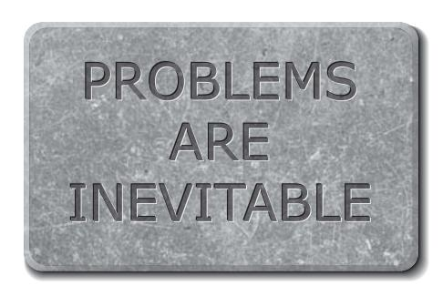
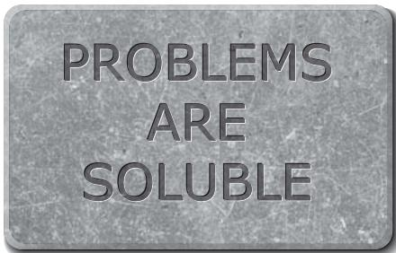

# 3 The Spark

Most ancient accounts of the reality beyond our everyday experience were not only false, they had a radically different character from modern ones: they were *anthropocentric*. That is to say, they centred on human beings, and more broadly on *people* – entities with intentions and human-like thoughts – which included powerful, supernatural people such as spirits and gods. So, winter might be attributed to someone's sadness, harvests to someone's generosity, natural disasters to someone's anger, and so on. Such explanations often involved cosmically significant beings caring what humans did, or having intentions about them. This conferred cosmic significance on humans too. Then the geocentric theory placed humans at the physical hub of the universe as well. Those two kinds of anthropocentrism – explanatory and geometrical – made each other more plausible, and, as a result, pre-Enlightenment thinking was more anthropocentric than we can readily imagine nowadays.

A notable exception was the science of geometry itself, especially the system developed by the ancient Greek mathematician Euclid. Its elegant axioms and modes of reasoning about impersonal entities such as points and lines would later be an inspiration to many of the pioneers of the Enlightenment. But until then it had little impact on prevailing world views. For example, most astronomers were also astrologers: despite using sophisticated geometry in their work, they believed that the stars foretold political and personal events on Earth.

Before anything was known about how the world works, trying to explain physical phenomena in terms of purposeful, human-like thought and action may have been a reasonable approach. After all, that is how we explain much of our everyday experience even today: if a jewel is mysteriously missing from a locked safe, we seek humanlevel explanations such as error or theft (or, under some circumstances, conjuring), not new laws of physics. But that anthropocentric approach has never yielded any good explanations beyond the realm of human affairs. In regard to the physical world at large, it was colossally misconceived. We now know that the patterns of stars and planets in our night sky have no significance for human affairs. We know that we are not at the centre of the universe – it does not even have a geometrical centre. And we know that, although some of the titanic astrophysical phenomena that I have described played a significant role in our past, we have never been significant to them. We call a phenomenon *significant* (or *fundamental*) if parochial theories are inadequate to explain it, or if it appears in the explanation of many other phenomena; so it may seem that human beings and their wishes and actions are extremely insignificant in the universe at large.

Anthropocentric misconceptions have also been overturned in every other fundamental area of science: our knowledge of physics is now expressed entirely in terms of entities that are as impersonal as Euclid's points and lines, such as elementary particles, forces and spacetime – a four-dimensional continuum with three dimensions of space and one of time. Their effects on each other are explained not in terms of feelings and intentions, but through mathematical equations expressing laws of nature. In biology, it was once thought that living things must have been designed by a supernatural person, and that they must contain some special ingredient, a 'vital principle', to make them behave with apparent purposefulness. But biological science discovered new modes of explanation through such impersonal things as chemical reactions, genes and evolution. So we now know that living things, including humans, all consist of the same ingredients as rocks and stars, and obey the same laws, and that they were not designed by anyone. Modern science, far from explaining physical phenomena in terms of the thoughts and intentions of unseen people, considers our own thoughts and intentions to be aggregates of unseen (though not un seeable) microscopic physical processes in our brains.

So fruitful has this abandonment of anthropocentric theories been, and so important in the broader history of ideas, that *anti*-anthropocentrism has increasingly been elevated to the status of a universal principle, sometimes called the 'Principle of Mediocrity': *there is*  *nothing significant about humans (in the cosmic scheme of things)*. As the physicist Stephen Hawking put it, humans are 'just a chemical scum on the surface of a typical planet that's in orbit round a typical star on the outskirts of a typical galaxy'. The proviso 'in the cosmic scheme of things' is necessary because the chemical scum evidently does have a special significance according to values that it applies to itself, such as moral values. But the Principle says that all such values are themselves anthropocentric: they explain only the behaviour of the scum, which is itself insignificant.

It is easy to mistake quirks of one's own, familiar environment or perspective (such as the rotation of the night sky) for objective features of what one is observing, or to mistake rules of thumb (such as the prediction of daily sunrises) for universal laws. I shall refer to that sort of error as *parochialism*.

Anthropocentric errors are examples of parochialism, but not all parochialism is anthropocentric. For instance, the prediction that the seasons are in phase all over the world is a parochial error but not an anthropocentric one: it does not involve explaining seasons in terms of people.

Another influential idea about the human condition is sometimes given the dramatic name *Spaceship Earth*. Imagine a 'generation ship' – a spaceship on a journey so long that many generations of passengers live out their lives in transit. This has been proposed as a means of colonizing other star systems. In the Spaceship Earth idea, that generation ship is a metaphor for the *biosphere* – the system of all living things on Earth and the regions they inhabit. Its passengers represent all humans on Earth. Outside the spaceship, the universe is implacably hostile, but the interior is a vastly complex life-support system, capable of providing everything that the passengers need to thrive. Like the spaceship, the biosphere recycles all waste and, using its capacious nuclear power plant (the sun), it is completely self-sufficient.

Just as the spaceship's life-support system is designed to sustain its passengers, so the biosphere has the 'appearance of design': it seems highly adapted to sustaining us (claims the metaphor) because *we* were adapted to *it* by evolution. But its capacity is finite: if we overload it, either by our sheer numbers or by adopting lifestyles too different from those that we evolved to live (the ones that it is 'designed' to support), it will break down. And, like the passengers on that spaceship, we get no second chances: if our lifestyle becomes too careless or profligate and we ruin our life-support system, we have nowhere else to go.

The Spaceship Earth metaphor and the Principle of Mediocrity have both gained wide acceptance among scientifically minded people – to the extent of becoming truisms. This is despite the fact that, on the face of it, they argue in somewhat opposite directions: the Principle of Mediocrity stresses how *typical* the Earth and its chemical scum are (in the sense of being unremarkable), while Spaceship Earth stresses how *untypical* they are (in the sense of being uniquely suited to each other). But when the two ideas are interpreted in broad, philosophical ways, as they usually are, they can easily converge. Both see themselves as correcting much the same parochial misconceptions, namely that our experience of life on Earth is representative of the universe, and that the Earth is vast, fixed and permanent. They both stress instead that it is tiny and ephemeral. Both oppose arrogance: the Principle of Mediocrity opposes the pre-Enlightenment arrogance of believing ourselves significant in the world; the Spaceship Earth metaphor opposes the Enlightenment arrogance of aspiring to control the world. Both have a moral element: we *should not* consider ourselves significant, they assert; we *should not* expect the world to submit indefinitely to our depredations.

Thus the two ideas generate a rich conceptual framework that can inform an entire world view. Yet, as I shall explain, they are both false, even in the straightforward factual sense. And in the broader sense they are so misleading that, if you were seeking maxims worth being carved in stone and recited each morning before breakfast, you could do a lot worse than to use their *negations*. That is to say, the truth is that

People *are* significant in the cosmic scheme of things; and

The Earth's biosphere is *incapable* of supporting human life.

Consider Hawking's remark again. It is true that we are on a (somewhat) typical planet of a typical star in a typical galaxy. But we are far from typical of the matter in the universe. For one thing, about 80 per cent of that matter is thought to be invisible 'dark matter', which can neither emit nor absorb light. We currently detect it only through its indirect gravitational effects on galaxies. Only the remaining 20 per cent is matter of the type that we parochially call 'ordinary matter'. It is characterized by glowing continuously. We do not usually think of ourselves as glowing, but that is another parochial misconception, due to the limitations of our senses: we emit radiant heat, which is infrared light, and also light in the visible range, too faint for our eyes to detect.

Concentrations of matter as dense as ourselves and our planet and star, though numerous, are not exactly typical either. They are isolated, uncommon phenomena. The universe is mostly vacuum (plus radiation and dark matter). Ordinary matter is familiar to us only because we are made of it, and because of our untypical location near large concentrations of it.

Moreover, we are an uncommon form of ordinary matter. The commonest form is plasma (atoms dissociated into their electrically charged components), which typically emits bright, visible light because it is in stars, which are rather hot. We scums are mainly infra-red emitters because we contain liquids and complex chemicals which can exist only at a much lower range of temperatures.

The universe is pervaded with microwave radiation – the afterglow of the Big Bang. Its temperature is about 2.7 kelvin, which means 2.7 degrees above the coldest possible temperature, absolute zero, or about 270 degrees Celsius colder than the freezing point of water. Only very unusual circumstances can make anything colder than those microwaves. Nothing in the universe is known to be cooler than about *one*  kelvin – except in certain physics laboratories on Earth. There, the record low temperature achieved is below one *billionth* of a kelvin. At those extraordinary temperatures, the glow of ordinary matter is effectively extinguished. The resulting 'non-glowing ordinary matter' on our planet is an exceedingly exotic substance in the universe at large. It may well be that the interiors of refrigerators constructed by physicists are by far the coldest and darkest places in the universe. Far from typical.

What is a typical place in the universe like? Let me assume that you are reading this on Earth. In your mind's eye, travel straight upwards a few hundred kilometres. Now you are in the slightly more typical environment of space. But you are still being heated and illuminated by the sun, and half your field of view is still taken up by the solids, liquids and scums of the Earth. A typical location has none of those features. So, travel a few trillion kilometres further in the same direction. You are now so far away that the sun looks like other stars. You are at a much colder, darker and emptier place, with no scum in sight. But it is not yet typical: you are still inside the Milky Way galaxy, and most places in the universe are not in any galaxy. Continue until you are clear outside the galaxy – say, a hundred thousand light years from Earth. At this distance you could not glimpse the Earth even if you used the most powerful telescope that humans have yet built. But the Milky Way still fills much of your sky. To get to a typical place in the universe, you have to imagine yourself at least a thousand times as far out as that, deep in intergalactic space.

What is it like there? Imagine the whole of space notionally divided into cubes the size of our solar system. If you were observing from a typical one of them, the sky would be pitch black. The nearest star would be so far away that if it were to explode as a supernova, and you were staring directly at it when its light reached you, you would not see even a glimmer. That is how big and dark the universe is. And it is cold: it is at that background temperature of 2.7 kelvin, which is cold enough to freeze every known substance except helium. (Helium is believed to remain liquid right down to absolute zero, unless highly pressurized.)

And it is empty: the density of atoms out there is below one per cubic metre. That is a million times sparser than atoms in the space between the stars, and those atoms are themselves sparser than in the best vacuum that human technology has yet achieved. Almost all the atoms in intergalactic space are hydrogen or helium, so there is no chemistry. No life could have evolved there, nor any intelligence. Nothing changes there. Nothing happens. The same is true of the next cube and the next, and if you were to examine a million consecutive cubes in any direction the story would be the same.

Cold, dark and empty. That unimaginably desolate environment is typical of the universe – and is another measure of how *un*typical the Earth and its chemical scum are, in a straightforward physical sense. The issue of the cosmic significance of this type of scum will shortly take us back out into intergalactic space. But let me first return to Earth, and consider the Spaceship Earth metaphor, in *its* straightforward physical version.

This much is true: if, tomorrow, physical conditions on the Earth's surface were to change even slightly by astrophysical standards, then no humans could live here unprotected, just as they could not survive on a spaceship whose life-support system had broken down. Yet I am writing this in Oxford, England, where winter nights are likewise often cold enough to kill any human unprotected by clothing and other technology. So, while intergalactic space would kill me in a matter of seconds, Oxfordshire in its primeval state might do it in a matter of hours – which can be considered 'life support' only in the most contrived sense. There *is* a life-support system in Oxfordshire today, but it was not provided by the biosphere. It has been built by humans. It consists of clothes, houses, farms, hospitals, an electrical grid, a sewage system and so on. Nearly the whole of the Earth's biosphere in its primeval state was likewise incapable of keeping an unprotected human alive for long. It would be much more accurate to call it a death trap for humans rather than a life-support system. Even the Great Rift Valley in eastern Africa, where our species evolved, was barely more hospitable than primeval Oxfordshire. Unlike the life-support system in that imagined spaceship, the Great Rift Valley lacked a safe water supply, and medical equipment, and comfortable living quarters, and was infested with predators, parasites and disease organisms. It frequently injured, poisoned, drenched, starved and sickened its 'passengers', and most of them died as a result.

It was similarly harsh to all the other organisms that lived there: few individuals live comfortably or die of old age in the supposedly beneficent biosphere. That is no accident: most populations, of most species, are living close to the edge of disaster and death. It has to be that way, because as soon as some small group, somewhere, begins to have a slightly easier life than that, for any reason – for instance, an increased food supply, or the extinction of a competitor or predator – then its numbers increase. As a result, its other resources are depleted by the increased usage; so an increasing proportion of the population now has to colonize more marginal habitats and make do with inferior resources, and so on. This process continues until the disadvantages caused by the increased population have exactly balanced the advantage conferred by the beneficial change. That is to say, the new birth rate is again just barely keeping pace with the rampant disabling and killing of individuals by starvation, exhaustion, predation, overcrowding and all those other natural processes.

That is the situation to which evolution adapts organisms. And that, therefore, is the lifestyle in which the Earth's biosphere 'seems adapted' to sustaining them. The biosphere only ever achieves stability – and only temporarily at that – by continually neglecting, harming, disabling and killing individuals. Hence the metaphor of a spaceship or a lifesupport system, is quite perverse: when humans design a life-support system, they design it to provide the maximum possible comfort, safety and longevity for its users within the available resources; the biosphere has no such priorities.

Nor is the biosphere a great preserver of *species*. In addition to being notoriously cruel to individuals, evolution involves continual extinctions of entire species. The average rate of extinction since the beginning of life on Earth has been about ten species per year (the number is known only very approximately), becoming much higher during the relatively brief periods that palaeontologists call 'mass extinction events'. The rate at which species have come into existence has on balance only slightly exceeded the extinction rate, and the net effect is that the overwhelming majority of species that have ever existed on Earth (perhaps 99.9 per cent of them) are now extinct. Genetic evidence suggests that our own species narrowly escaped extinction on at least one occasion. Several species closely related to ours did become extinct. Significantly, the 'life-support system' itself wiped them out – by means such as natural disasters, evolutionary changes in other species, and climate change. Those cousins of ours had not invited extinction by changing their lifestyles or overloading the biosphere: on the contrary, it wiped them out because they *were* living the lifestyles that they had evolved to live, and in which, according to the Spaceship Earth metaphor, the biosphere had been 'supporting' them.

Yet that still overstates the degree to which the biosphere is hospitable to humans in particular. The first people to live at the latitude of Oxford (who were actually from a species related to us, possibly the Neanderthals) could do so only because they brought knowledge with them, about such things as tools, weapons, fire and clothing. That knowledge was transmitted from generation to generation not genetically but culturally. Our pre-human ancestors in the Great Rift Valley used such knowledge too, and our own species must have come into existence already dependent on it for survival. As evidence of that, note that I would soon die if I tried to live in the Great Rift Valley in its primeval state: I do not have the requisite knowledge. Since then, there have been human populations who, for instance, knew how to survive in the Amazon jungle but not in the Arctic, and populations for whom it was the other way round. Therefore that knowledge was not part of their genetic inheritance. It was created by human thought, and preserved and transmitted in human culture.

Today, almost the entire capacity of the Earth's 'life-support system for humans' has been provided not *for* us but *by* us, using our ability to create new knowledge. There are people in the Great Rift Valley today who live far more comfortably than early humans did, and in far greater numbers, through knowledge of things like tools, farming and hygiene. The Earth did provide the raw materials for our survival – just as the sun has provided the energy, and supernovae provided the elements, and so on. But a heap of raw materials is not the same thing as a life-support system. It takes knowledge to convert the one into the other, and biological evolution never provided us with enough knowledge to survive, let alone to thrive. In this respect we differ from almost all other species. They do have all the knowledge that they need, genetically encoded in their brains. And that knowledge was indeed provided for them by evolution – and so, in the relevant sense, 'by the biosphere'. So *their* home environments do have the appearance of having been designed as life-support systems for them, albeit only in the desperately limited sense that I have described. But the biosphere no more provides humans with a life-support system than it provides us with radio telescopes.

So the biosphere is incapable of supporting human life. From the outset, it was only human knowledge that made the planet even marginally habitable by humans, and the enormously increased capacity of our life-support system since then (in terms both of numbers and of security and quality of life) has been entirely due to the creation of human knowledge. To the extent that we are on a 'spaceship', we have never been merely its passengers, nor (as is often said) its stewards, nor even its maintenance crew: we are its designers and builders. Before the designs created by humans, it was not a vehicle, but only a heap of dangerous raw materials.

The 'passengers' metaphor is a misconception in another sense too. It implies that there was a time when humans lived unproblematically: when they were provided for, like pas sengers, without themselves having to solve a stream of problems in order to survive and to thrive. But in fact, even with the benefit of their cultural knowledge, our ancestors continually faced desperate problems, such as where the next meal was coming from, and typically they barely solved these problems or they died. There are very few fossils of old people.

The moral component of the Spaceship Earth metaphor is therefore somewhat paradoxical. It casts humans as ungrateful for gifts which, in reality, they never received. And it casts all other species in morally positive roles in the spaceship's life-support system, with humans as the only negative actors. But humans are part of the biosphere, and the supposedly immoral behaviour is identical to what all other species do when times are good – except that humans alone try to mitigate the effect of that response on their descendants and on other species.

The Principle of Mediocrity is paradoxical too. Since it singles out anthropocentrism for special opprobrium among all forms of parochial misconception, it is itself anthropocentric. Also, it claims that all value judgements are anthropocentric, yet it itself is often expressed in valueladen terminology, such as 'arrogance', 'just scum' and the very word 'mediocrity'. With respect to whose values are those disparagements to be understood? Why is arrogance even relevant as a criticism? Also, even if holding an arrogant opinion is morally wrong, morality is supposed to refer only to the internal organization of chemical scum. So how can it tell us anything about how the world *beyond* the scum is organized, as the Principle of Mediocrity purports to do?

In any case, it was not arrogance that made people adopt anthropocentric explanations. It was merely a parochial error, and quite a reasonable one originally. Nor was it arrogance that prevented people from realizing their mistake for so long: they didn't realize *anything*, because they did not know how to seek better explanations. In a sense their whole problem was that they were not arrogant *enough*: they assumed far too easily that the world was fundamentally incomprehensible to them.

The misconception that there was once an unproblematic era for humans is present in ancient myths of a past Golden Age, and of a Garden of Eden. The theological notions of *grace* (unearned benefit from God) and *Providence* (which is God regarded as the provider of human needs) are also related to this. In order to connect the supposed unproblematic past with their own less-than-pleasant experiences, the authors of such myths had to include some past transition, such as a Fall from Grace when Providence reduced its level of support. In the Spaceship Earth metaphor, the Fall from Grace is usually deemed to be imminent or under way.

The Principle of Mediocrity contains a similar misconception. Consider the following argument, which is due to the evolutionary biologist Richard Dawkins: Human attributes, like those of all other organisms, evolved under natural selection in an ancestral environment. That is why our senses are adapted to detecting things like the colours and smell of fruit, or the sound of a predator: being able to detect such things gave our ancestors a better chance of surviving to have offspring. But, for the same reason, Dawkins points out, evolution did not waste our resources on detecting phenomena that were never relevant to our survival. We cannot, for instance, distinguish between the colours of most stars with the naked eye. Our night vision is poor and monochromatic because not enough of our ancestors died of that limitation to create evolutionary pressure for anything better. So Dawkins argues – and here he is invoking the Principle of Mediocrity – that there is no reason to expect our brains to be any different from our eyes in this regard: they evolved to cope with the narrow class of phenomena that commonly occur in the bio sphere, on approximately human scales of size, time, energy and so on. Most phenomena in the universe happen far above or below those scales. Some would kill us instantly; others could never affect anything in the lives of early humans. So, just as our senses cannot *detect* neutrinos or quasars or most other significant phenomena in the cosmic scheme of things, there is no reason to expect our brains to *understand* them. To the extent that they already do understand them, we have been lucky – but a run of luck cannot be expected to continue for long. Hence Dawkins agrees with an earlier evolutionary biologist, John Haldane, who expected that 'the universe is not only queerer than we suppose, but queerer than we *can* suppose.'

That is a startling – and paradoxical – consequence of the Principle of Mediocrity: it says that all human abilities, including the distinctive ones such as the ability to create new explanations, are necessarily parochial. That implies, in particular, that progress in science cannot exceed a certain limit defined by the biology of the human brain. And we must expect to reach that limit sooner rather than later. Beyond it, the world stops making sense (or seems to). The answer to the question that I asked at the end of Chapter 2 – whether the scientific revolution and the broader Enlightenment could be a beginning of infinity – would then be a resounding no. Science, for all its successes and aspirations, would turn out to be inherently parochial – and, ironically, anthropocentric.

So here the Principle of Mediocrity and Spaceship Earth converge. They share a conception of a tiny, human-friendly bubble embedded in the alien and uncooperative universe. The Spaceship Earth metaphor sees it as a physical bubble, the biosphere. For the Principle of Mediocrity, the bubble is primarily conceptual, marking the limits of the human capacity to understand the world. Those two bubbles are related, as we shall see. In both views, anthropocentrism is true in the interior of the bubble: there the world is unproblematic, uniquely compliant with human wishes and human understanding. Outside it there are only insoluble problems.

Dawkins would prefer it to be otherwise. As he wrote:

I believe that an orderly universe, one indifferent to human preoccupations, in which everything has an explanation even if we still have a long way to go before we find it, is a more beautiful, more wonderful place than a universe tricked out with capricious ad hoc magic.

*Unweaving the Rainbow* (1998)

An 'orderly' (explicable) universe is indeed more beautiful (see Chapter 14) – though the assumption that to be orderly it has to be 'indifferent to human preoccupations' is a misconception associated with the Principle of Mediocrity.

Any assumption that the world is *in*explicable can lead only to

extremely bad explanations. For an inexplicable world is indistinguishable from one 'tricked out with capricious ad hoc magic': by definition, no hypothesis about the world outside the bubble of explicability can be a better explanation than that Zeus rules there – or practically any myth or fantasy one likes.

Moreover, since the outside of the bubble affects our explanations of the inside (or else we may as well do without it), the inside is not really explicable either. It seems so only if we carefully refrain from asking certain questions. This bears an uncanny resemblance to the intellectual landscape before the Enlightenment, with its distinction between Earth and heaven. It is a paradox inherent in the Principle of Mediocrity: contrary to its motivation, here it is forcing us back to an archaic, anthropocentric, pre-scientific conception of the world.

At root, the Principle of Mediocrity and the Spaceship Earth metaphor overlap in a claim about *reach*: they both claim that the reach of the distinctively human way of being – that is to say, the way of problemsolving, knowledge-creating and adapting the world around us – is bounded. And they argue that its bounds cannot be very far beyond what it has already reached. Trying to go beyond that range must lead to failure and catastrophe respectively.

Both ideas also rely on essentially the same argument, namely that if there were no such limit, there would be no explanation for the continued effectiveness of the adaptations of the human brain beyond the conditions under which they evolved. Why should one adaptation out of the trillions that have ever existed on Earth have unlimited reach, when all others reach only inside the tiny, insignificant, untypical biosphere? Fair enough: all reach has an explanation. But what if there *is* an explanation, and what if it has nothing to do with evolution or the biosphere?

Imagine that a flock of birds from a species that evolved on one island happens to fly to another. Their wings and eyes still work. That is an example of the reach of those adaptations. It has an explanation, the essence of which is that wings and eyes exploit universal laws of physics (of aerodynamics and optics respectively). They exploit those laws only imperfectly; but the atmospheric and lighting conditions on the two islands are sufficiently similar, by the criteria defined by those laws, for the same adaptations to work on both.

Thus the birds may well be able to fly to an island many kilometres away horizontally, but if they were transported only a few kilometres upwards their wings would stop working because the density of the air would be too low. Their implicit knowledge about how to fly fails at high altitude. A little further up, their eyes and other organs would stop working. The design of these too does not have that much reach: all vertebrate eyes are filled with liquid water, but water freezes at stratospheric temperatures and boils in the vacuum of space. Less dramatically, the birds might also die if they merely had no good night vision and they reached an island where the only suitable prey organisms were nocturnal. For the same reason, biological adaptations also have limited reach in regard to changes in their *home* environment – which can and do cause extinctions.

If those birds' adaptations do have enough reach to make the species viable on the new island, they will set up a colony there. In subsequent generations, mutants slightly better adapted to the new island will end up having slightly more offspring on average, so evolution will adapt the population more accurately to contain the knowledge needed to make a living there. The ancestor species of humans colonized new habitats and embarked on new lifestyles in exactly that way. But by the time our species had evolved, our fully human ancestors were achieving much the same thing thousands of times faster, by evolving their cultural knowledge instead. Because they did not yet know how to do science, their knowledge was only a little less parochial than biological knowledge. It consisted of rules of thumb. And so progress, though rapid compared to biological evolution, was sluggish compared to what the Enlightenment has accustomed us to.

Since the Enlightenment, technological progress has depended specifically on the creation of explanatory knowledge. People had dreamed for millennia of flying to the moon, but it was only with the advent of Newton's theories about the behaviour of invisible entities such as forces and momentum that they began to understand what was needed in order to go there.

This increasingly intimate connection between *explaining* the world and *controlling* it is no accident, but is part of the deep structure of the world. Consider the set of all conceivable transformations of physical objects. Some of those (like faster-than-light communication) never happen because they are forbidden by laws of nature; some (like the formation of stars out of primordial hydrogen) happen spontaneously; and some (such as converting air and water into trees, or converting raw materials into a radio telescope) are possible, but happen only when the requisite knowledge is present – for instance, embodied in genes or brains. But those are the only possibilities. That is to say, every putative physical transformation, to be performed in a given time with given resources or under any other conditions, is either

- impossible because it is forbidden by the laws of nature; or
- achievable, given the right knowledge.

That momentous dichotomy exists because if there were transformations that technology could never achieve regardless of what knowledge was brought to bear, then this fact would itself be a testable regularity in nature. But all regularities in nature have explanations, so the explanation of that regularity would itself be a law of nature, or a consequence of one. And so, again, everything that is not forbidden by laws of nature is achievable, given the right knowledge.

This fundamental connection between explanatory knowledge and technology is why the Haldane–Dawkins queerer-than-we-can-suppose argument is mistaken – why the reach of human adaptations does have a different character from that of all the other adaptations in the biosphere. The ability to create and use explanatory knowledge gives *people* a power to transform nature which is ultimately not limited by parochial factors, as all other adaptations are, but only by universal laws. This is the cosmic significance of explanatory knowledge – and hence of people, whom I shall henceforward define as entities that can create explanatory knowledge.

For every other species on Earth, we can determine its reach simply by making a list of all the resources and environmental conditions on which its adaptations depend. In principle one could determine those from a study of its DNA molecules – because that is where all its genetic information is encoded (in the form of sequences of small constituent molecules called 'bases'). As Dawkins has pointed out:

A gene pool is carved and whittled through generations of ancestral natural selection to fit [a particular] environment. In theory a knowledgeable zoologist, presented with the complete transcript of a genome [the set of all the genes of an organism], should be able to reconstruct the environmental circumstances that did the carving. In this sense the DNA is a coded description of ancestral environments.

In Art Wolfe, *The Living Wild*, ed. Michelle A. Gilders (2000)

To be precise, the 'knowledgeable zoologist' would be able to reconstruct only those aspects of the organism's ancestral environment that exerted selection pressure – such as the types of prey that existed there, what behaviours would catch them, what chemicals would digest them and so on. Those are all regularities in the environment. A genome contains coded descriptions of them, and hence implicitly specifies the environments in which the organism can survive. For example, all primates require vitamin C. Without it, they fall ill and die of the disease scurvy, but their genes do not contain the knowledge of how to synthesize it. So, whenever any non-human primate is in an environment that does not supply vitamin C for an extended period, it dies. Any account that overlooks this fact will overestimate the reach of those species. Humans are primates, yet *their* reach has nothing to do with which environments supply vitamin C. Humans can create and apply new knowledge of how to cause it to be synthesized from a wide range of raw materials, by agriculture or in chemical factories. And, just as essentially, humans can discover for themselves that, in most environments, they *need* to do that in order to survive.

Similarly, whether humans could live entirely outside the biosphere – say, on the moon – does not depend on the quirks of human bio chemistry. Just as humans currently cause over a tonne of vitamin C to appear in Oxfordshire every week (from their farms and factories), so they could do the same on the moon – and the same goes for breathable air, water, a comfortable temperature and all their other parochial needs. Those needs can all be met, given the right knowledge, by transforming other resources. Even with present-day technology, it would be possible to build a self-sufficient colony on the moon, powered by sunlight, recycling its waste, and obtaining raw materials from the moon itself. Oxygen is plentiful on the moon in the form of metal oxides in moon rock. Many other elements could easily be extracted too. Some elements are rare on the moon, and so in practice these would be supplied from the Earth, but in principle the colony could be entirely independent of the Earth if it sent robot space vehicles to mine asteroids for such elements, or if it manufactured them by transmutation.

I specified *robot* space vehicles because all technological knowledge can eventually be implemented in automated devices. This is another reason that 'one per cent inspiration and ninety-nine per cent perspiration' is a misleading description of how progress happens: *the 'per spiration' phase can be automated* – just as the task of recognizing galaxies on astronomical photographs was. And the more advanced technology becomes, the shorter is the gap between inspiration and automation. The more this happens in the moon colony, the less human effort will be required to live there. Eventually the moon colonists will take air for granted, just as the people now living in Oxfordshire take for granted that water will flow if they turn on a tap. If either of those populations lacked the right knowledge, their environment would soon kill them.

We are accustomed to thinking of the Earth as hospitable and the moon as a bleak, faraway deathtrap. But that is how our ancestors would have regarded Oxfordshire, and, ironically, it is how I, today, would regard the primeval Great Rift Valley. In the unique case of humans, the difference between a hospitable environment and a deathtrap depends on what knowledge they have created. Once enough knowledge has been embodied in the lunar colony, the colonists can devote their thoughts and energies to creating even more knowledge, and soon it will cease to be a colony and become simply home. No one will think of the moon as a fringe habitat, distinguished from our 'natural' environment on Earth, any more than we now think of Oxfordshire as being fundamentally different from the Great Rift Valley as a place to live.

Using knowledge to cause automated physical transformations is, in itself, not unique to humans. It is the basic method by which all organisms keep themselves alive: every cell is a chemical factory. The difference between humans and other species is in what kind of knowledge they can use (explanatory instead of rule-of-thumb) and in how they create it (conjecture and criticism of ideas, rather than the variation and selection of genes). It is precisely those two differences that explain why every other organism can function only in a certain range of environments that are hospitable to it, while humans transform *in*hospitable environments like the biosphere into support systems for themselves. And, while every other organism is a factory for converting resources of a fixed type into more such organisms, human bodies (including their brains) are factories for transforming *anything into anything* that the laws of nature allow. They are 'universal constructors'.

This universality in the human condition is part of a broader phe nomenon that I shall discuss in Chapter 6. We do not share it with any other species currently on Earth. But, since it is a consequence of the ability to create explanations, we do necessarily share it with any other people that might exist in the universe. The opportunities provided by the laws of nature for transforming resources are universal, and all entities with universal reach necessarily have the same reach.

A few species other than humans are known to be capable of having cultural knowledge. For example, some apes can discover new methods of cracking nuts, and pass that knowledge on to other apes. As I shall discuss in Chapter 16, the existence of such knowledge is suggestive of how ape-like species evolved into people. But it is irrelevant to the arguments of this chapter, because no such organism is capable of creating or using explanatory knowledge. Hence the cultural knowledge of such organisms is of essentially the same type as genetic knowledge, and does indeed have only a small and inherently limited reach. They are not universal constructors, but highly specialized ones. For them, the Haldane–Dawkins argument is valid: the world is stranger than they can conceive.

In some environments in the universe, the most efficient way for humans to thrive might be to alter their own genes. Indeed, we are already doing that in our present environment, to eliminate diseases that have in the past blighted many lives. Some people object to this on the grounds (in effect) that a genetically altered human is no longer human. This is an anthropomorphic mistake. The only uniquely signifi cant thing about humans (whether in the cosmic scheme of things or according to any rational human criterion) is our ability to create new explanations, and we have that in common with all people. You do not become less of a person if you lose a limb in an accident; it is only if you lose your brain that you do. Changing our genes in order to improve our lives and to facilitate further improvements is no different in this regard from augment ing our skin with clothes or our eyes with telescopes.

One might wonder whether the reach of people in general might be greater than the reach of humans. What if, for instance, the reach of technology is indeed unlimited, but only to creatures with two opposable thumbs on each hand; or if the reach of scientific knowledge is unlimited, but only to beings whose brains are twice the size of ours? But our faculty of being universal constructors makes these issues as irrelevant as that of access to vitamins. If progress at some point were to depend on having two thumbs per hand, then the outcome would depend not on the knowledge we inherit in our genes, but on whether we could discover how to build robots, or gloves, with two thumbs per hand, or alter ourselves to have a second thumb. If it depends on having more memory capacity, or speed, than a human brain, then the outcome would depend on whether we could build computers to do the job. Again, such things are already commonplace in technology.

The astrophysicist Martin Rees has speculated that somewhere in the universe 'there could be life and intelligence out there in forms we can't conceive. Just as a chimpanzee can't understand quantum theory, it could be there are aspects of reality that are beyond the capacity of our brains.' But that cannot be so. For if the 'capacity' in question is mere computational speed and amount of memory, then we can understand the aspects in question with the help of computers – just as we have understood the world for centuries with the help of pencil and paper. As Einstein remarked, 'My pencil and I are more clever than I.' In terms of computational repertoire, our computers – and brains – are already universal (see Chapter 6). But if the claim is that we may be *qualitatively* unable to understand what some other forms of intelligence can – if our disability cannot be remedied by mere automation – then this is just another claim that the world is not explicable. Indeed, it is tantamount to an appeal to the supernatural, with all the arbitrariness that is inherent in such appeals, for if we wanted to incorporate into our world view an imaginary realm explicable only to superhumans, we need never have bothered to abandon the myths of Persephone and her fellow deities.

So human reach is essentially the same as the reach of explanatory knowledge itself. An environment is within human reach if it is possible to create an open-ended stream of explanatory knowledge there. That means that if knowledge of a suitable kind were instantiated in such an environment in suitable physical objects, it would cause itself to survive and would then continue to increase indefinitely. Can there really be such an environment? This is essentially the question that I asked at the end of the last chapter – *can this creativity continue indefinitely?* – and it is the question to which the Spaceship Earth metaphor assumes a negative answer.

The issue comes down to this: if such an environment can exist, what are the minimal physical features that it must have? Access to *matter* is one. For example, the trick of extracting oxygen from moon rocks depends on having compounds of oxygen available. With more advanced technology, one could manufacture oxygen by transmutation; but, no matter how advanced one's technology is, one still needs raw materials of some sort. And, although mass can be recycled, creating an open-ended stream of knowledge depends on having an ongoing supply of it, both to make up for inevitable inefficiencies and to make the additional memory capacity to store new knowledge as it is created.

Also, many of the necessary transformations require *energy*: something must power conjectures and scientific experiments and all those manufacturing processes; and, again, the laws of physics forbid the creation of energy from nothing. So access to an energy supply is also a necessity. To some extent, energy and mass can be transformed into each other. For instance, transmuting hydrogen into any other element releases energy through nuclear fusion. Energy can also be converted into mass by various subatomic processes (but I cannot imagine naturally occurring circumstances in which those would be the best way of obtaining matter).

In addition to matter and energy, there is one other essential requirement, namely *evidence*: the information needed to test scientific theories. The Earth's surface is rich in evidence. We happened to get round to testing Newton's laws in the seventeenth century, and Einstein's in the twentieth, but the evidence with which we did that – light from the sky – had been deluging the surface of the Earth for billions of years before that, and will continue to do so for billions more. Even today we have barely begun to examine that evidence: on any clear night, the chances are that your roof will be struck by evidence falling from the sky which, if you only knew what to look for and how, would win you a Nobel prize. In chemistry, every stable element that exists anywhere is also present on or just below the Earth's surface. In biology, copious evidence of the nature of life is ubiquitous in the biosphere – and within arm's reach, in our own DNA. As far as we know, all the fundamental constants of nature can be measured here, and every fundamental law can be tested here. Everything needed for the open-ended creation of knowledge is here in abundance, in the Earth's biosphere.

And the same is true of the moon. It has essentially the same resources of mass, energy and evidence as the Earth has. Parochial details differ, but the fact that humans living on the moon will have to make their own air is no more significant than the fact that laboratories on Earth have to make their own vacuum. Both tasks can be automated so as to require arbitrarily little human effort or attention. Likewise, because humans are universal constructors, *every* problem of finding or transform ing resources can be no more than a transient factor limiting the creation of knowledge in a given environment. And therefore matter, energy and evidence are the only requirements that an environment needs to have in order to be a venue for open-ended knowledge creation.

Though any particular problem is a transient factor, the condition of having to solve problems in order to survive and continue to create knowledge is permanent. I have mentioned that there has never been an unproblematic time for humans; that applies as much to the future as to the past. Today on Earth, in the short run, there are still countless problems to be solved to eliminate even starvation and other forms of extreme human suffering that date back to prehistory. On a timescale of decades, we shall be faced with choices to make substantial modifications to the biosphere, or to keep it the same, or anything in between. Whichever option we choose, it will be a project of planet-wide control, requiring the creation of a great deal of scientific and tech nological knowledge as well as knowledge about how to make such decisions rationally (see Chapter 13). In the even longer run, it is not only our comfort and aesthetic sensibilities, and the suffering of individ uals, that are problematic, but, as always, the survival of our species. For instance, at present during any given century there is about one chance in a thousand that the Earth will be struck by a comet or asteroid large enough to kill at least a substantial proportion of all human beings. That means that a typical child born in the United States today is more likely to die as a result of an astronomical event than a car accident. Both are very low-probability events, but, unless we create a great deal more scientific and technological knowledge than we have now, we shall have no defence against those and other forms of natural disaster that must, eventually, strike. Arguably there are more immediate existential threats too – see Chapter 9.

Setting up self-sufficient colonies on the moon and elsewhere in the solar system – and eventually in other solar systems – will be a good hedge against the extinction of our species or the destruction of civilization, and is a highly desirable goal for that reason among others. As Hawking has said:

I don't think the human race will survive the next thousand years, unless we spread into space. There are too many accidents that can befall life on a single planet. But I'm an optimist. We will reach out to the stars.

*Daily Telegraph*, 16 October 2001

But even that will be far from an unproblematic state. And most people are not satisfied merely to be confident in the survival of the *species*: they want to survive personally. Also, like our earliest human ancestors, they want to be free from physical danger and suffering. In future, as various causes of suffering and death such as disease and ageing are successively addressed and eliminated, and human life spans increase, people will care about ever longer-term risks.

In fact people will always want still more than that: they will want to make progress. For, in addition to threats, there will always be problems in the benign sense of the word: errors, gaps, inconsistencies and inadequacies in our knowledge that we wish to solve – including, not least, moral knowledge: knowledge about *what to want*, what to strive for. The human mind seeks explanations; and now that we know how to find them, we are not going to stop voluntarily. Here is another misconception in the Garden of Eden myth: that the supposed unproblematic state would be a *good* state to be in. Some theologians have denied this, and I agree with them: an unproblematic state is a state without creative thought. Its other name is death.

All those kinds of problem (survival-related, progress-related, moral, and sheer-curiosity-driven problems) are connected. We can, for in stance, expect that our ability to cope with existential threats will continue to depend on knowledge that was originally created for its own sake. And we can expect disagreements about goals and values always to exist, because, among other reasons, moral explanations depend partly on facts about the physical world. For instance, the moral stances in the Principle of Mediocrity and the Spaceship Earth idea depend on the physical world not being explicable in the sense that I have argued it must be.

Nor will we ever run out of problems. The deeper an explanation is, the more new problems it creates. That must be so, if only because there can be no such thing as an ultimate explanation: just as 'the gods did it' is always a bad explanation, so any other purported foundation of all explanations must be bad too. It must be easily variable because it cannot answer the question: why that foundation and not another? Nothing can be explained only in terms of itself. That holds for philosophy just as it does for science, and in particular it holds for *moral* philosophy: no utopia is possible, but only because our values and our objectives can continue to improve indefinitely.

Thus fallibilism alone rather understates the error-prone nature of knowledge-creation. Knowledge-creation is not only *subject* to error: errors are common, and significant, and always will be, and correcting them will always reveal further and better problems. And so the maxim that I suggested should be carved in stone, namely 'The Earth's biosphere is *incapable* of supporting human life' is actually a special case of a much more general truth, namely that, for people, *problems are inevitable*. So let us carve *that* in stone:

It is inevitable that we face problems, but no particular problem is inevitable. We survive, and thrive, by solving each problem as it comes

up. And, since the human ability to transform nature is limited only by the laws of physics, none of the endless stream of problems will ever constitute an impassable barrier. So a complementary and equally important truth about people and the physical world is that *problems are soluble.* By 'soluble' I mean that the right knowledge would solve them. It is not, of course, that we can possess knowledge just by wishing for it; but it is in principle accessible to us. So let us carve that in stone too:

That *progress* is both possible and desirable is perhaps the quintessential idea of the Enlightenment. It motivates all traditions of criticism, as well as the principle of seeking good explanations. But it can be interpreted in two almost opposite ways, both of which, confusingly, are known as 'perfectibility'. One is that humans, or human societies, are capable of attaining a state of supposed perfection – such as the Buddhist or Hindu 'nirvana', or various political utopias. The other is that every attainable state can be indefinitely improved. Fallibilism rules out that first position in favour of the second. Neither the human condition in particular nor our explanatory knowledge in general will ever be perfect, nor even approximately perfect. We shall always be at the *beginning* of infinity.

These two interpretations of human progress and perfectibility have historically inspired two broad branches of the Enlightenment which, though they share attributes such as their rejection of authority, are so different in important respects in that it is most unfortunate that they share the same name. The utopian 'Enlightenment' is sometimes called the Continental (European) Enlightenment to distinguish it from the more fallibilist British Enlightenment, which began a little earlier and

took a very different course. (See, for instance, the historian Roy Porter's book *Enlightenment*.) In my terminology, the Continental Enlightenment understood that problems are soluble but not that they are inevitable, while the British Enlightenment understood both equally. Note that this is a classification of ideas, not of nations or even individual thinkers: not all Enlightenment thinkers belong wholly to one branch or the other; nor were all thinkers of the respective Enlighten ments born in the eponymous part of the world. The mathematician and philosopher Nicholas de Condorcet, for instance, was French yet belonged more to what I am calling the 'British' Enlightenment, while Karl Popper, the twentieth century's foremost proponent of the British Enlightenment, was born in Austria.

The Continental Enlightenment was impatient for the perfected state – which led to intellectual dogmatism, political violence and new forms of tyranny. The French Revolution of 1789 and the Reign of Terror that followed it are the archetypal examples. The British Enlightenment, which was evolutionary and cognizant of human fallibility, was im patient for institutions that did not stifle gradual, continuing change. It was also enthusiastic for small improvements, unbounded in the future. (See, for instance, the historian Jenny Uglow's book *Lunar Men*.) This is, I believe, the movement that was successful in its pursuit of progress, so in this book when I refer to 'the' Enlightenment I mean the 'British' one.

To investigate the ultimate reach of humans (or of people, or of progress), we should not be considering places like the Earth and the moon, which are unusually rich in resources. Let us go back to that typical place. While the Earth is inundated with matter, energy and evidence, out there in intergalactic space all three are at their lowest possible supply. There is no rich supply of minerals, no vast nuclear reactor overhead delivering free energy, no lights in the sky or diverse local events to provide evidence of the laws of nature. It is empty, cold and dark.

Or is it? Actually, that is yet another parochial misconception. Intergalactic space is indeed very empty by human standards. But each of those solar-system-sized cubes still contains over a billion tonnes of matter – mostly in the form of ionized hydrogen. A billion tonnes is more than enough mass to build, say, a space station and a colony of scientists creating an open-ended stream of knowledge – *if* anyone were present who knew how to do that.

No human today knows how. For instance, one would first have to transmute some of the hydrogen into other elements. Collecting it from such a diffuse source would be far beyond us at present. And, although some types of transmutation are already routine in the nuclear industry, we do not know how to transmute hydrogen into other elements on an industrial scale. Even a simple nuclear-fusion reactor is currently beyond our technology. But physicists are confident that it is not forbidden by any laws of physics, in which case, as always, it can only be a matter of knowing how.

No doubt a billion-tonne space station is not large enough to thrive in the very long run. The inhabitants will want to enlarge it. But that presents no problem of principle. As soon as they started to trawl their cube for hydrogen, more would drift in from the surrounding space, supplying the cube with millions of tonnes of hydrogen per year. (There is also believed to be an even greater mass of 'dark matter' in the cube, but we do not know how to do anything useful with it, so let us ignore it in this thought experiment.)

As for the cold, and the lack of available energy – as I said, the transmutation of hydrogen releases the energy of nuclear fusion. That would be a sizeable power supply, orders of magnitude more than the combined power consumption of everyone on Earth today. So the cube is not as lacking in resources as a parochial first glance would suggest.

How would the space station get its vital supply of evidence? Using the elements created by transmutation, one could construct scientific laboratories, as in the projected moon base. On Earth, when chemistry was in its infancy, making discoveries often depended on travelling all over the planet to find materials to experiment on. But transmutation makes that irrelevant; and chemical laboratories on the space station would be able to synthesize arbitrary compounds of arbitrary elements. The same is true of elementary particle physics: in that field, almost anything will do as a source of evidence, because every atom is potentially a cornucopia of particles just waiting to display themselves if one hits the atom hard enough (using a particle accelerator) and observes with the right instruments. In biology, DNA and all other biochemical molecules could be synthesized and experimented on. And, although biology field trips would be difficult (because the closest natural eco system would be millions of light years away), arbitrary life forms could be created and studied in artificial ecosystems, or in virtual-reality simulations of them. As for astronomy – the sky there is pitch black to the human eye, but to an observer with a telescope, even one of present-day design, it would be packed with galaxies. A somewhat bigger telescope could see stars in those galaxies in sufficient detail to test most of our present-day theories of astrophysics and cosmology.

Even aside from those billion tonnes of matter, the cube is not empty. It is full of faint light, and the amount of evidence in that light is staggering: enough to construct a map of every star, planet and moon in all the nearest galaxies to a resolution of about ten kilometres. To extract that evidence in full, the telescope would need to use something like a mirror of the same width as the cube itself, which would require at least as much matter as building a planet. But even that would not be beyond the bounds of possibility, given the level of technology we are considering. To gather that much matter, those intergalactic scientists would merely have to trawl out to a distance of a few thousand cube-widths – still a piffling distance by intergalactic standards. But even with a mere million-tonne telescope they could do a lot of astronomy. The fact that planets with tilted axes have annual seasons would be plain to see. They could detect life if it was present on any of the planets, via the composition of its atmosphere. With more subtle measurements they could test theories about the nature and history of life – or intelligence – on the planet. At any instant, a typical cube contains evidence, at that level of detail, about more than a trillion stars and their planets, simultaneously.

And that is only one instant. Additional evidence of all those kinds is pouring into the cube all the time, so astronomers there could track changes in the sky just as we do. And visible light is only one band of the electromagnetic spectrum. The cube is receiving evidence in every other band too – gamma rays, X-rays, all the way down to the microwave background radiation and radio waves, as well as a few cosmicray particles. In short, nearly all the channels by which we on Earth currently receive evidence about any of the fundamental sciences are available in intergalactic space too.

And they carry much the same content: not only is the universe full

of evidence, it is full of the same evidence everywhere. All people in the universe, once they have understood enough to free themselves from parochial obstacles, face essentially the same opportunities.This is an underlying unity in the physical world more significant than all the dissimilarities I have described between our environment and a typical one: the fundamental laws of nature are so uniform, and evidence about them so ubiquitous, and the connections between understanding and control so intimate, that, whether we are on our parochial home planet or a hundred million light years away in the intergalactic plasma, we can do the same science and make the same progress.

So a typical location in the universe is amenable to the open-ended creation of knowledge. And therefore so are almost all other kinds of environment, since they have more matter, more energy and easier access to evidence than intergalactic space. The thought experiment considered almost the worst possible case. Perhaps the laws of physics do not allow knowledge-creation inside, say, the jet of a quasar. Or perhaps they do. But either way, in the universe at large, knowledgefriendliness is the rule, not the exception. That is to say, the rule is person-friendliness *to people who have the relevant knowledge*. Death is the rule for those who do not. These are the same rules that prevailed in the Great Rift Valley from whence we came, and have prevailed ever since.

Oddly enough, that quixotic space station in our thought experiment is none other than the 'generation ship' in the Spaceship Earth metaphor – except that we have removed the unrealistic assumption that the inhabitants never improve it. Hence presumably they have long since solved the problem of how to avoid dying, and so 'generations' are no longer essential to the way their ship works. In any case, with hindsight, a generation ship was a poor choice for dramatizing the claim that the human condition is fragile and dependent on support from an unaltered biosphere, for that claim is contradicted by the very possibility of such a spaceship. If it is possible to live indefinitely in a spaceship in space, then it would be much more possible to use the same technology to live on the surface of the Earth – and to make continuing progress which would make it ever easier. It would make little practical difference whether the biosphere had been ruined or not. Whether or not it could support any other species, it could certainly accommodate people – including humans – if they had the right knowledge.

Now I can turn to the significance of knowledge – and therefore of people – in the cosmic scheme of things.

Many things are more *obviously* significant than people. Space and time are significant because they appear in almost all explanations of other physical phenomena. Similarly, electrons and atoms are significant. Humans seem to have no place in that exalted company. Our history and politics, our science, art and philosophy, our aspirations and moral values – all these are tiny side effects of a supernova ex plosion a few billion years ago, which could be extinguished tomorrow by another such explosion. Supernovae, too, are moderately significant in the cosmic scheme of things. But it seems that one can explain everything about supernovae, and almost everything else, without ever mentioning people or knowledge at all.

However, that is merely another parochial error, due to our current, untypical, vantage point in an Enlightenment that is mere centuries old. In the longer run, humans may colonize other solar systems and, by increasing their knowledge, control ever more powerful physical processes. If people ever choose to live near a star that is capable of exploding, they may well wish to prevent such an explosion – probably by removing some of the material from the star. Such a project would use many orders of magnitude more energy than humans currently control, and more advanced technology as well. But it is a fundamentally simple task, not requiring any steps that are even close to limits imposed by the laws of physics. So, with the right knowledge, it could be achieved. Indeed, for all we know, engineers elsewhere in the universe are already achieving it routinely. And consequently it is not true that the attributes of supernovae in general are independent of the presence or absence of people, or of what those people know and intend.

More generally, if we want to predict what a star will do, we first have to guess whether there are any people near it, and, if so, what knowledge they may have and what they may want to achieve. Outside our parochial perspective, astrophysics is incomplete without a theory of people, just as it is incomplete without a theory of gravity or nuclear reactions. Note that this conclusion does not depend on the assumption that humans, or anyone, *will* colonize the galaxy and take control of any supernovae: the assumption that they will not is equally a theory about the future behaviour of knowledge. Knowledge is a significant phenomenon in the universe, because to make almost any prediction about astrophysics one must *take a position* about what types of knowledge will or will not be present near the phenomena in question. So all explanations of what is out there in the physical world mention knowledge and people, if only implicitly.

But knowledge is more significant even than that. Consider any physical object – for instance, a solar system, or a microscopic chip of silicon – and then consider all the transformations that it is physically possible for it to undergo. For instance, the silicon chip might be melted and solidify in a different shape, or be transformed into a chip with different functionality. The solar system might be devastated when its star becomes a supernova, or life might evolve on one of its planets, or it might be transformed, using transmutation and other futuristic technologies, into microprocessors. In all cases, the class of transformations that could happen spontaneously – in the absence of knowledge – is negligibly small compared with the class that could be effected artificially by intelligent beings who wanted those transformations to happen. So the explanations of *almost all physically possible phenomena* are about how knowledge would be applied to bring these phenomena about. If you want to explain how an object might possibly reach a temperature of ten degrees or a million, you can refer to spontaneous processes and can avoid mentioning people explicitly (even though *most* processes at those temperatures can be brought about only by people). But if you want to explain how an object might possibly cool down to a millionth of a degree above absolute zero, you cannot avoid explaining in detail what people would do.

And that is still only the least of it. In your mind's eye, continue your journey from that point in intergalactic space to another, at least ten times as far away. Our destination this time is inside one of the jets of a quasar. What would it be like in one of those jets? Language is barely capable of expressing it: it would be rather like facing a supernova explosion at point-blank range, but for millions of years at a time. The survival time for a human body would be measured in picoseconds. As I said, it is unclear whether the laws of physics permit any knowledge to grow there, let alone a life-support system for humans. It is about as different from our ancestral environment as it could possibly be. The laws of physics that explain it bear no resemblance to any rules of thumb that were ever in our ancestors' genes or in their culture. Yet human brains today know in considerable detail what is happening there.

Somehow that jet happens in such a way that billions of years later, on the other side of the universe, a chemical scum can know and predict what the jet will do, and can understand why. That means that one physical system – say, an astrophysicist's brain – contains an accurate working model of the other, the jet. Not just a superficial image (though it contains that as well), but an explanatory theory that embodies the same mathematical relationships and causal structure. That is scientific knowledge. Furthermore, the faithfulness with which the one structure resembles the other is steadily increasing. That constitutes the creation of knowledge. Here we have physical objects very unlike each other, and whose behaviour is dominated by different laws of physics, embodying the same mathematical and causal structures – and doing so ever more accurately over time. Of all the physical processes that can occur in nature, only the creation of knowledge exhibits that underlying unity.

In Arecibo, Puerto Rico, there is a giant radio telescope, one of whose many uses is in the Search For Extraterrestrial Intelligence (SETI). In an office in a building near the telescope there is a small domestic refrigerator. Inside that refrigerator is a bottle of champagne, sealed by a cork. Consider that cork.

It is going to be removed from the bottle if and when SETI succeeds in its mission to detect radio signals transmitted by an extraterrestrial intelligence. Hence, if you were to keep a careful watch on the cork, and one day saw it popping from the bottle, you could infer that an extraterrestrial intelligence exists. The configuration of the cork is what experimentalists call a 'proxy': a physical variable which can be measured as a way of measuring another variable. (All scientific measure ments involve chains of proxies.) Thus we can also regard the entire Arecibo observatory, including its staff and that bottle and its cork, as a scientific instrument to detect distant people.

The behaviour of that humble cork is therefore extraordinarily difficult to explain or predict. To predict it, you have to know whether there really are people sending radio signals from various solar systems. To explain it, you have to explain how you know about those people and their attributes. Nothing less than that specific knowledge, which depends among other things on subtle properties of the chemistry on the planets of distant stars, can explain or predict with any accuracy whether, and when, that cork will pop.

The SETI instrument is also remarkably finely tuned to its purpose. Completely insensitive to the presence of several tonnes of people a few metres away, and even to the tens of millions of tonnes of people on the same planet, it detects only people on planets orbiting other stars, and only if they are radio engineers. No other type of phenomenon on Earth, or in the universe, is sensitive to what people are doing at locations hundreds of light years away, let alone with that enormous degree of discrimination.

This is made possible in part by the corresponding fact that few types of matter are as prominent, at those distances, as that type of scum. Specifically, the only phenomena that our best current instruments can detect at stellar distances are (1) extraordinarily luminous ones such as stars (or, to be precise, only their surfaces); (2) a few objects that obscure our view of those luminous objects; and (3) the effects of certain types of knowledge. We can detect devices such as lasers and radio transmitters that have been designed for the purpose of communication; and we can detect components of planetary atmospheres that could not be present in the absence of life. Thus those types of knowledge are among the most prominent phenomena in the universe.

Note also that the SETI instrument is exquisitely adapted to detecting something that has never yet been detected. Biological evolution could never produce such an adaptation. Only scientific knowledge can. This illustrates why non-explanatory knowledge cannot be universal. Like all science, the SETI project can conjecture the existence of something, calculate what some of its observable attributes would be, and then construct an instrument to detect it. Non-explanatory systems cannot cross the conceptual gap that an explanatory conjecture crosses, to engage with unexperienced evidence or non-existent phenomena. Nor is that true only of fundamental science: *if* such-and-such a load were put on the proposed bridge it would collapse, says the engineer, and such statements can be true and immensely valuable even if the bridge is never even built, let alone subjected to such a load.

Similar champagne bottles are stored in other laboratories. The popping of each such cork signals a discovery about something significant in the cosmic scheme of things. Thus the study of the behaviour of champagne corks and other proxies for what people do is logically equivalent to the study of *everything* significant. It follows that humans, people and knowledge are not only objectively significant: they are by far the most significant phenomena in nature – the only ones whose behaviour cannot be understood without understanding everything of fundamental importance.

Finally, consider the enormous difference between how an environment will behave spontaneously (that is to say, in the absence of knowledge) and how it behaves once a tiny sliver of knowledge, of just the right kind, has reached it. We would normally regard a lunar colony, even after it has become self-sufficient, as having originated on Earth. But what, exactly, will have originated on Earth? In the long run, all its atoms have originated on the moon (or the asteroids). All the energy that it uses has originated in the sun. Only some proportion of its *knowledge* came from Earth, and, in the hypothetical case of a perfectly isolated colony, that would be a rapidly dwindling proportion. What has happened, physically, is that the *moon* has been changed – initially only minimally – by matter that came from the Earth. And what made the difference was not the matter, but the knowledge that it encoded. In response to that knowledge, the substance of the moon reorganized itself in a new, increasingly extensive and complex way, and started to create an indefinitely long stream of ever-improving explanations. A beginning of infinity.

Similarly, in the intergalactic thought experiment, we imagined 'priming' a typical cube, and as a result intergalactic space itself began to produce a stream of ever-improving explanations. Notice how different, physically, the transformed cube is from a typical one. A typical cube has about the same mass as any of the millions of nearby cubes, and that mass barely changes over many millions of years. The transformed cube is more massive than its neighbours, and its mass is increasing continuously as the inhabitants systematically capture matter and use it to embody knowledge. The mass of a typical cube is spread thinly throughout its whole volume; most of the mass of the transformed cube is concentrated at its centre. A typical cube contains mostly hydrogen; the transformed cube contains every element. A typical cube is not producing any energy; the transformed cube is converting mass to energy at a substantial rate. A typical cube is full of evidence, but most of it is just passing through, and none of it ever causes any changes. The transformed cube contains even more evidence, most of it having been created locally, and is detecting it with everimproving instruments and changing rapidly as a result. A typical cube is not emitting any energy; the transformed cube may well be broadcasting explanations into space. But perhaps the biggest physical difference is that, like all knowledge-creating systems, the transformed cube corrects errors. You would notice this if you tried to modify or harvest the matter in it: it would resist!

It appears, nevertheless, that most environments are not yet creating any knowledge. We know of none that is, except on or near the Earth, and what we see happening elsewhere is radically different from what would happen if knowledge-creation were to become widespread. But the universe is still young. An environment that is not currently creating anything may do so in the future. What will be typical in the distant future could be very different from what is typical now.

Like an explosive awaiting a spark, unimaginably numerous environments in the universe are waiting out there, for aeons on end, doing nothing at all or blindly generating evidence and storing it up or pouring it out into space. Almost any of them would, if the right knowledge ever reached it, instantly and irrevocably burst into a radically different type of physical activity: intense knowledge-creation, displaying all the various kinds of complexity, universality and reach that are inherent in the laws of nature, and transforming that environment from what is typical today into what could become typical in the future. If we want to, we could be that spark.

#### terminology

*Person* An entity that can create explanatory knowledge.

*Anthropocentric* Centred on humans, or on persons.

*Fundamental or significant phenomenon*: One that plays a necessary

role in the explanation of many phenomena, or whose distinctive features require distinctive explanation in terms of fundamental theories.

*Principle of Mediocrity* 'There is nothing significant about humans.' *Parochialism* Mistaking appearance for reality, or local regularities for universal laws.

*Spaceship Earth* 'The biosphere is a life-support system for humans.' *Constructor* A device capable of causing other objects to undergo transformations without undergoing any net change itself.

*Universal constructor* A constructor that can cause any raw materials to undergo any physically possible transformation, given the right information.

#### meanings of 'the beginning of infinity' encountered in this chapter

- The fact that everything that is not forbidden by laws of nature is achievable, given the right knowledge. 'Problems are soluble.'
- The 'perspiration' phase can always be automated.
- The knowledge-friendliness of the physical world.
- People are universal constructors.
- The beginning of the open-ended creation of explanations.
- The environments that could create an open-ended stream of knowledge, if suitably primed – i.e. almost all environments.
- The fact that new explanations create new problems.

#### summary

Both the Principle of Mediocrity and the Spaceship Earth idea are, contrary to their motivations, irreparably parochial and mistaken. From the least parochial perspectives available to us, *people* are the most significant entities in the cosmic scheme of things. They are not 'supported' by their environments, but support themselves by creating knowledge. Once they have suitable knowledge (essentially, the knowledge of the Enlightenment), they are capable of sparking unlimited further progress.

Apart from the thoughts of people, the only process known to be

capable of creating knowledge is biological evolution. The knowledge it creates (other than via people) is inherently bounded and parochial. Yet it also has close similarities with human knowledge. The similarities and the differences are the subject of the next chapter.

