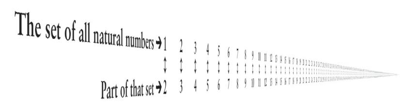
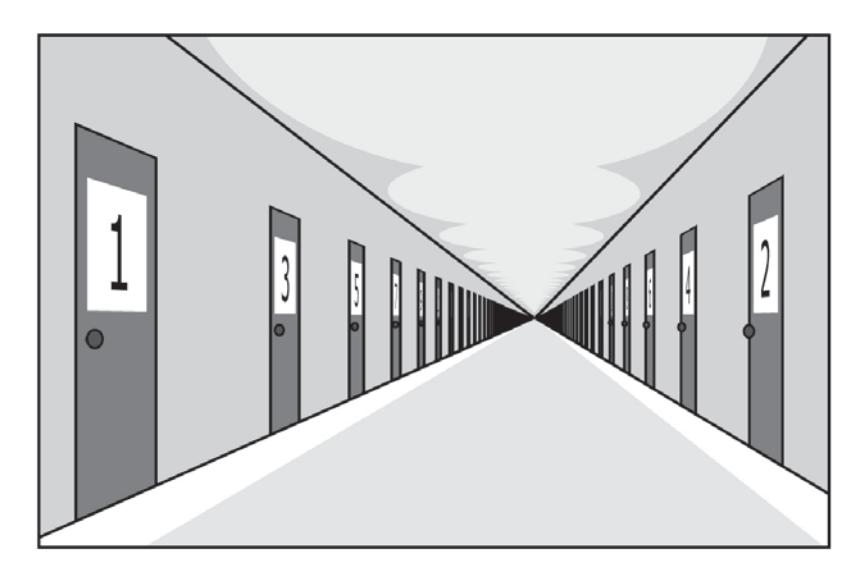
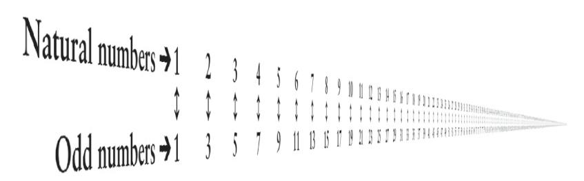
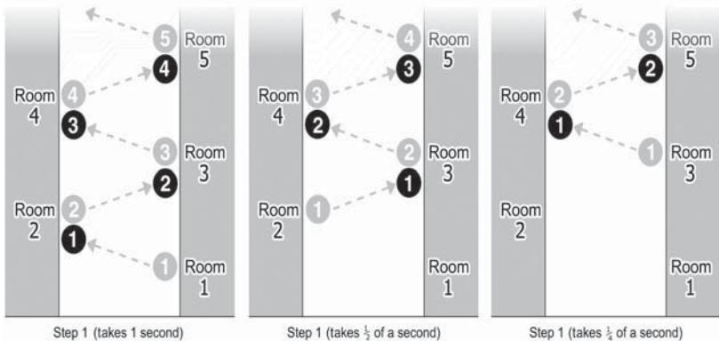
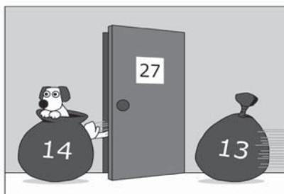

### A Window on Infinity

Mathematicians realized centuries ago that it is possible to work consistently and usefully with infinity. Infinite sets, infinitely large quantities and also infinitesimal quantities all make sense. Many of their properties are counter-intuitive, and the introduction of theories about infinities has always been controversial; but many facts about finite things are just as counter-intuitive. What Dawkins calls the 'argument from personal incredulity' is no argument: it represents nothing but a preference for parochial misconceptions over universal truths.

In physics, too, infinity has been contemplated since antiquity. Euclidean space was infinite; and, in any case, space was usually regarded as a continuum: even a finite line was composed of infinitely many points. There were also infinitely many instants between any two times. But the understanding of continuous quantities was patchy and con tradictory until Newton and Leibniz invented calculus, a technique for analysing continuous change in terms of infinite numbers of infinitesimal changes.

The 'beginning of infinity' – the possibility of the unlimited growth of knowledge in the future – depends on a number of other infinities. One of them is the universality in the laws of nature which allows finite, local symbols to apply to the whole of time and space – and to all phenomena and all possible phenomena. Another is the existence of physical objects that are universal explainers – people – which, it turns out, are necessarily universal constructors as well, and must contain universal classical computers.

Most forms of universality themselves refer to some sort of infinity – though they can always be interpreted in terms of something being *unlimited* rather than actually infinite. This is what opponents of infinity call a 'potential infinity' rather than a 'realized' one. For instance, the beginning of infinity can be described either as a condition where 'progress in the future will be *unbounded'* or as the condition where 'an *infinite* amount of progress will be made'. But I use those concepts interchangeably, because in this context there is no substantive difference between them.

There is a philosophy of mathematics called *finitism*, the doctrine that only finite abstract entities exist. So, for instance, there are infinitely many natural numbers, but finitists insist that that is just a manner of speaking. They say that the literal truth is only that there is a finite rule for generating each natural number (or, more precisely, each numeral) from the previous one, and nothing literally infinite is involved. But this doctrine runs into the following problem: is there a largest natural number or not? If there is, then that contradicts the statement that there is a rule that defines a larger one. If there is not, then there are not finitely many natural numbers. Finitists are then obliged to deny a principle of logic: the 'law of the excluded middle', which is that, for every meaningful proposition, either it or its negation is true. So finitists say that, although there is no largest number, there is not an infinity of numbers either.

Finitism is instrumentalism applied to mathematics: it is a principled rejection of explanation. It attempts to see mathematical entities purely as procedures that mathematicians follow, rules for making marks on paper and so on – useful in some situations, but not referring to anything real other than the finite objects of experience such as two apples or three oranges. And so finitism is inherently anthropocentric – which is not surprising, since it regards parochialism as a virtue of a theory rather than a vice. It also suffers from another fatal flaw that instrumentalism and empiricism have in regard to science, which is that it assumes that mathematicians have some sort of privileged access to *finite* entities which they do not have for infinite ones. But that is not the case. All observation is theory-laden. All abstract theorizing is theory-laden too. All access to abstract entities, finite or infinite, is via theory, just as for physical entities.

In other words finitism, like instrumentalism, is nothing but a project for preventing progress in understanding the entities beyond our direct experience. But that means progress generally, for, as I have explained, there are no entities *within* our 'direct experience'.

The whole of the above discussion assumes the universality of *reason*. The reach of science has inherent limitations; so does mathematics; so does every branch of philosophy. But if you believe that there are bounds on the domain in which reason is the proper arbiter of ideas, then you believe in unreason or the supernatural. Similarly, if you reject the infinite, you are stuck with the finite, and the finite is parochial. So there is no way of stopping there. The best explanation of *anything*  eventually involves universality, and therefore infinity. The reach of explanations cannot be limited by fiat.

One expression of this within mathematics is the principle, first made explicit by the mathematician Georg Cantor in the nineteenth century, that abstract entities may be defined in any desired way out of other entities, so long as the definitions are unambiguous and consistent. Cantor founded the modern mathematical study of infinity. His principle was defended and further generalized in the twentieth century by the mathematician John Conway, who whimsically but appropriately named it *the mathematicians' liberation movement*. As those defences suggest, Cantor's discoveries encountered vitriolic opposition among his contemporaries, including most mathematicians of the day and also many scientists, philosophers – and theologians. Religious objections, ironically, were in effect based on the Principle of Mediocrity. They characterized attempts to understand and work with infinity as an encroachment on the prerogatives of God. In the mid twentieth century, long after the study of infinity had become a routine part of mathematics and had found countless applications there, the philosopher Ludwig Wittgenstein still contemptuously denounced it as 'meaningless'. (Though eventually he also applied that accusation to the whole of philosophy, including his own work – see Chapter 12.)

I have already mentioned other examples of the principled rejection of infinity. There was the strange aversion of Archimedes, Apollonius and others to universal systems of numerals. There are doctrines such as instrumentalism and finitism. The Principle of Mediocrity sets out to escape parochialism and to reach for infinity, but ends up confining science to an infinitesimal and unrepresentative bubble of comprehensibility. There is also pessimism, which (as I shall discuss in the following chapter) wants to attribute failure to the existence of a finite bound on improvement. One instance of pessimism is the paradoxical parochialism of Spaceship Earth – a vehicle that would be far better suited as a metaphor for infinity.

Whenever we refer to infinity, we are making use of the infinite reach of some idea. For whenever an idea of infinity makes sense, that is because there is an explanation of why some finite set of rules for manipulating finite symbols refers to something infinite. (Let me repeat that this underlies our knowledge of everything else as well.)

In mathematics, infinity is studied via infinite sets (meaning sets with infinitely many members). The defining property of an infinite set is that some part of it has as many elements as the whole thing. For instance, think of the natural numbers:

The set of natural numbers has as many members as a part of itself.

In the upper line in the illustration, every natural number appears exactly once. The lower line contains only part of that set: the natural numbers starting at 2. The illustration tallies the two sets – mathematicians call it a 'one-to-one correspondence' – to prove that there are equally many numbers in each.

The mathematician David Hilbert devised a thought experiment to illustrate some of the intuitions that one has to drop when reasoning about infinity. He imagined a hotel with infinitely many rooms: *Infinity Hotel*. The rooms are numbered with the natural numbers, starting with 1 and ending with – what?

The last room number is not infinity. First of all, there is no last room. The idea that any numbered set of rooms has a highest-numbered member is the first intuition from everyday life that we have to drop. Second, in any finite hotel whose rooms were numbered from 1, there would be a room whose number equalled the total number of rooms, and other rooms whose numbers were close to that: if there were ten rooms, one of them would be room number ten, and there would be a room number nine as well. But in Infinity Hotel, where the number of rooms is infinity, *all* the rooms have numbers infinitely far below infinity.

The beginning of infinity – the rooms in Infinity Hotel

Now imagine that Infinity Hotel is fully occupied. Each room contains one guest and cannot contain more. With finite hotels, 'fully occupied' is the same thing as 'no room for more guests'. But Infinity Hotel always has room for more. One of the conditions of staying there is that guests have to change rooms if asked to by the management. So, if a new guest arrives, the management just announce over the public-address system, 'Will all guests please move immediately to the room numbered one more than their current room.' Thus, in the manner of the first illustration in this chapter, the existing occupant of room 1 moves to room 2, whose occupant moves to room 3, and so on. What happens at the last room? There is no last room, and hence no problem about what happens there. The new arrival can now move into room 1. At Infinity Hotel, it is never necessary to make a reservation.

Evidently no such place as Infinity Hotel could exist in our universe,

because it violates several laws of physics. However, this is a *mathematical* thought experiment, so the only constraint on the imaginary laws of physics is that they be consistent. It is *because* of the requirement that they be consistent that they are counter-intuitive: intuitions about infinity are often illogical.

It is a bit awkward to have to keep changing rooms – though they are all identical and are freshly made up every time a guest moves in. But guests love staying at Infinity Hotel. That is because it is cheap – only a dollar a night – yet extraordinarily luxurious. How is that possible? Every day, when the management receive all the room rents of one dollar per room, they spend the income as follows. With the dollars they received from the rooms numbered 1 to 1000, they buy complimentary champagne, strawberries, housekeeping services and all the other overheads, *just for room 1*. With the dollars they received from the rooms numbered 1001 to 2000, they do the same for room 2, and so on. In this way, each room receives several hundred dollars' worth of goods and services every day, and the management make a profit as well, all from their income of one dollar per room.

Word gets around, and one day an infinitely long train pulls up at the local station, containing infinitely many people wanting to stay at the hotel. Making infinitely many public-address announcements would take too long (and, anyway, the hotel rules say that each guest can be asked to perform only a finite number of actions per day), but no matter. The management merely announce, 'Will all guests please move immediately to the room whose number is double that of their current room.' Obviously they can all do that, and afterwards the only occupied rooms are the even numbered ones, leaving the odd-numbered ones free for the new arrivals. That is exactly enough to receive the infinitely many new guests, because there are exactly as many odd numbers as there are natural numbers, as illustrated overleaf:

There are exactly as many odd numbers as there are natural numbers.

So the first new arrival goes to room 1, the second to room 3, and so on.

Then, one day, an *infinite number* of infinitely long trains arrive at the station, all full of guests for the hotel. But the managers are still unperturbed. They just make a slightly more complicated announcement, which readers who are familiar with mathematical terminology can see in this footnote.\* The upshot is: everyone is accommodated.

However, it *is* mathematically possible to overwhelm the capacity of Infinity Hotel. In a remarkable series of discoveries in the 1870s, Cantor proved, among other things, that not all infinities are equal. In particular, the infinity of the continuum – the number of points in a finite line (which is the same as the number of points in the whole of space or spacetime) – is much larger than the infinity of the natural numbers. Cantor proved this by proving that there can be no one-toone correspondence between the natural numbers and the points in a line: that set of points has a higher order of infinity than the set of natural numbers.

Here is a version of his proof – known as the *diagonal argument.*  Imagine a one-centimetre-thick pack of cards, each one so thin that there is one of them for every 'real number' of centimetres between 0 and 1. Real numbers can be defined as the decimal numbers between those limits, such as 0.7071. . ., where the ellipsis again denotes a continuation that may be infinitely long. It is impossible to deal out

\*First, they announce to the existing guests, 'For each natural number *N*, will the guest in room number *N* please move immediately to room number *N*(*N* +1)/2.' Then they announce, 'For all natural numbers *N* and *M*, will the *N*th passenger from the *M*th train please go to room number [(*N* + *M*) 2 + *N* – *M*]/2.'

one of these cards to each room of Infinity Hotel. For suppose that the cards *were* so distributed. We can prove that this entails a contradiction. It would mean that cards had been assigned to rooms in something like the manner of the table below. (The particular numbers illustrated are not significant: we are going to prove that real numbers cannot be assigned in *any* order.)

Cantor's diagonal argument

Look at the infinite sequence of digits highlighted in bold – namely '**--**. . .'. Then consider a decimal number constructed as follows: it starts with zero followed by a decimal point, and continues arbitrarily, except that each of its digits must differ from the corresponding digit in the infinite sequence '**--**. . .'. For instance, we could choose a number such as '0.5885. . .'. The card with the number thus constructed cannot have been assigned to any room. For it differs in its first digit from that of the card assigned to room 1, and in its second digit from that of the card assigned to room 2, and so on. Thus it differs from all the cards that have been assigned to rooms, and so the original assumption that all the cards had been so assigned has led to a contradiction.

An infinity that *is* small enough to be placed in one-to-one cor respondence with the natural numbers is called a '*countable* infinity' – rather an unfortunate term, because no one can count up to infinity. But it has the connotation that every *element* of a countably infinite set could in principle be reached by counting those elements in some suitable order. Larger infinities are called *uncountable*. So, there is an uncountable infinity of real numbers between any two distinct limits.

| 0.  | 6     | 77976… |
|-----|-------|--------|
| 0.6 | 9     | 4698…  |
|     | 0.39  | 9 221… |
|     | 0.236 | 6 46…  |

Furthermore, there are uncountably many *orders* of infinity, each too large to be put into one-to-one correspondence with the lower ones.

Another important uncountable set is the set of *all logically possible reassignments* of guests to rooms in Infinity Hotel (or, as the mathematicians put it, all possible *permutations* of the natural numbers). You can easily prove that if you imagine any one reassignment specified in an infinitely long table, like this:

Specifying one reassignment of guests

Then imagine all possible reassignments listed one below the other, thus 'counting' them. The diagonal argument applied to this list will prove that the list is impossible, and hence that the set of all possible reassignments is uncountable.

Since the management of Infinity Hotel have to specify a reassignment in the form of a public-address announcement, the specification must consist of a finite sequence of words – and hence a finite sequence of characters from some alphabet. The set of such sequences is countable and therefore infinitely smaller than the set of possible reassignments*.*  That means that only an infinitesimal proportion of all logically possible reassignments can be specified. This is a remarkable limitation on the apparently limitless power of Infinity Hotel's management to shuffle the guests around. *Almost all* ways in which the guests could, as a matter of logic, be distributed among the rooms are unattainable.

Infinity Hotel has a unique, self-sufficient waste-disposal system. Every day, the management first rearrange the guests in a way that ensures that all rooms are occupied. Then they make the following announcement. 'Within the next minute, will all guests please bag their trash and give it to the guest in the next higher-numbered room. Should you *receive* a bag during that minute, then pass it on within the

| Guest in room number |     |    |    |     |  |
|----------------------|-----|----|----|-----|--|
| 1                    | 2   | 3  | 4  | ... |  |
|                      |     |    |    |     |  |
| Moves to             |     |    |    |     |  |
| 38                   | 173 | 80 | 30 | ... |  |

following half minute. Should you receive a bag during that half minute, pass it on within the following quarter minute, and so on.' To comply, the guests have to work fast – but none of them has to work *infinitely*  fast, or handle infinitely many bags. Each of them performs a finite number of actions, as per the hotel rules. After two minutes, all these trash-moving actions have ceased. So, two minutes after they begin, none of the guests has any trash left.

Infinity Hotel's waste-disposal system

All the trash in the hotel has disappeared from the universe. It is *nowhere*. No one has *put* it 'nowhere': every guest has merely moved some of it into another room. The 'nowhere' where all that trash has gone is called, in physics, a *singularity*. Singularities may well happen in reality, inside black holes and elsewhere. But I digress: at the moment, we are still discussing mathematics, not physics.

Of course, Infinity Hotel has infinitely many staff. Several of them are assigned to look after each guest. But the staff themselves are treated as guests in the hotel, staying in numbered rooms and receiving exactly the same benefits as every other guest: each of them has several other staff assigned to their welfare. However, they are not allowed to ask those staff to do their work for them. That is because, if they all did this, the hotel would grind to a halt. Infinity is not magic. It has logical rules: that is the whole point of the Infinity Hotel thought experiment.

The fallacious idea of delegating all one's work to other staff in

higher-numbered rooms is called an *infinite regress.* It is one of the things that one cannot validly do with infinity. There is an old joke about the heckler who interrupts an astrophysics lecture to insist that the Earth is flat and supported on the back of elephants standing on a giant turtle. 'What supports the turtle?' asks the lecturer. 'Another turtle.' 'What supports *that* turtle?' 'You can't fool me,' replies the heckler triumphantly: 'it's turtles from there on down.' That theory is a bad explanation not because it fails to explain *everything* (no theory does), but because what it leaves unexplained is effectively the same as what it purports to explain in the first place. (The theory that the designer of the biosphere was designed by another designer, and so on ad infinitum, is another example of an infinite regress.)

One day in Infinity Hotel, a guest's pet puppy happens to climb into a trash bag. The owner does not notice, and passes the bag, with the puppy, to the next room.

Within two minutes the puppy is nowhere. The distraught owner phones the front desk. The receptionist announces over the publicaddress system, 'We apologize for the inconvenience, but an item of value has been inadvertently thrown away. Will all guests please

undo all the trash-moving actions that they have just performed, in reverse order, starting as soon as you receive a trash bag from the

next-higher-numbered room.' But to no avail. None of the guests return any bags, because their fellow guests in the highernumbered rooms are not returning

any either. It was no exaggeration to say that the bags are nowhere. They have not been stuffed into a mythical 'room number infinity'. They no longer exist; nor does the puppy. No one has done anything to the puppy except move it to another numbered room, within the hotel. Yet it is not in any room. It is not anywhere in the hotel, or anywhere else. In a finite hotel, if you move an object from room to room, in however complicated a pattern, it will end up in one of those rooms. Not so with an infinite number of rooms. Every individual action that the guests performed was both harmless to the puppy and perfectly reversible. Yet, taken together, those actions annihilated the puppy and cannot be reversed.

Reversing them cannot work, because, if it did, there would be no explanation for why a puppy arrived at its owner's room and not a kitten. If a puppy did arrive, the explanation would have to be that a puppy was passed down from the next-higher-numbered room – and so on. But that whole infinite sequence of explanations never gets round to explaining 'why a puppy?' It is an infinite regress.

What if, one day, a puppy did just arrive at room 1, having been passed down through all the rooms? That is not *logically* impossible: it would merely lack an explanation. In physics, the 'nowhere' from which such a puppy would have come is called a 'naked singularity'. Naked singularities appear in some speculative theories in physics, but such theories are rightly criticized on the grounds that they cannot make predictions. As Hawking once put it, 'Television sets could come out [of a naked singularity].' It would be different if there were a law of nature determining what comes out – for in that case there would be no infinite regress and the singularity would not be 'naked'. The Big Bang may have been a singularity of that relatively benign type.

I said that the rooms are identical, but they do differ in one respect: their room numbers. So, given the types of tasks that the management request from time to time, the low-numbered rooms are the most desirable. For instance, the guest in room 1 has the unique privilege of never having to deal with anyone else's trash. Moving to room 1 feels like winning first prize in a lottery. Moving to room 2 feels only slightly less so. But *every* guest has a room number that is unusually close to the beginning. So every guest in the hotel is more privileged than almost all other guests. The clichéd politician's promise to favour *everyone* can be honoured in Infinity Hotel.

Every room is at the beginning of infinity. That is one of the attributes of the unbounded growth of knowledge too: we are only just scratching the surface, and shall never be doing anything else.

So there is no such thing as a *typical room number* at Infinity Hotel. Every room number is untypically close to the beginning. The intuitive idea that there must be 'typical' or 'average' members of any set of values is false for infinite sets. The same is true of the intuitive ideas of 'rare' and 'common'. We might think that half of all natural numbers are odd, and half even – so that odd and even numbers are equally common among the natural numbers. But consider the following rearrangement:

A rearrangement of the natural numbers that makes it look as though one-third of them are odd

That makes it look as though the odd numbers are only half as common as even ones. Similarly, we could make it look as though the odd numbers were one in a million or any other proportion. So the intuitive notion of a *proportion* of the members of a set does not necessarily apply to infinite sets either.

After the shocking loss of the puppy, the management of Infinity Hotel want to restore the morale of the guests, so they arrange a surprise. They announce that every guest will receive a complimentary copy of either *The Beginning of Infinity* or my previous book, *The Fabric of Reality.* They distribute them as follows: they dispatch a copy of the older book to every millionth room, and a copy of the newer book to each remaining room.

Suppose that you are a guest at the hotel. A book – gift-wrapped in opaque paper – appears in your room's delivery chute. You are hoping that it will be the newer book, because you have already read the old one. You are fairly confident that it *will* be, because, after all, what are the chances that your room is one of those that receive the old book? Exactly one in a million, it seems.

But, before you have a chance to open the package, there is an announcement. Everyone is to change rooms, to a number designated on a card that will come through the chute. The announcement also mentions that the new allocation will move all the recipients of one of the books to odd-numbered rooms, and the recipients of the other book to even-numbered ones, but it does not say which is which. So you cannot tell, from your new room number, which book you have received. Of course there is no problem with filling the rooms in this manner: both books had infinitely many recipients.

| 1 | 2 | 4 | 3 | 8 | 5 | 10 | 12 | 7 | 14 | 16 | ... |
|---|---|---|---|---|---|----|----|---|----|----|-----|
|   |   |   |   |   |   |    |    |   |    |    |     |

Your card arrives and you move to your new room. Are you now any less sure about which of the two books you have received? Presumably not. By your previous reasoning, there is now only a one in *two* chance that your book is *The Beginning of Infinity*, because it is now in 'half the rooms'. Since that is a contradiction, your method of assessing those probabilities must have been wrong. Indeed, all methods of assessing them are wrong, because – as this example shows – in Infinity Hotel there is *no such thing* as the probability that you have received the one book or the other.

Mathematically, this is nothing momentous. The example merely demonstrates again that the attributes probable or improbable, rare or common, typical or untypical have literally no meaning in regard to comparing infinite sets of natural numbers.

But, when we turn to physics, it is bad news for anthropic arguments. Imagine an infinite set of *universes*, all with the same laws of physics except that one particular physical constant, let us call it *D*, has a different value in each. (Strictly speaking, we should imagine an *un countable* infinity of universes, like those infinitely thin cards – but that only makes the problem I am about to describe worse, so let us keep things simple.) Assume that, of these universes, infinitely many have values of *D* that produce astrophysicists, and infinitely many have values that do not. Then let us number the universes in such a way that all those with astrophysicists have even numbers and all the ones without astrophysicists have odd numbers.

This does not mean that half the universes have astrophysicists. Just as with the book distribution in Infinity Hotel, we could equally well label the universes so that only every third universe, or every trillionth one, had astrophysicists, or so that every trillionth one did not. So there is something wrong with the anthropic explanation of the fine-tuning problem: we can make the fine-tuning go away just by relabelling the universes. At our whim, we can number them in such a way that astrophysicists seem to be the rule, or the exception, or anything in between.

Now, suppose that we calculate, using the relevant laws of physics with different values of *D*, whether astrophysicists will emerge. We find that for values of *D* outside the range from, say, 137 to 138, those that contain astrophysicists are very sparse: only one in a trillion such universes has astrophysicists. Within the range, only one in a trillion does *not* have astrophysicists, and for values of *D* between 137.4 and 137.6 they all do. Let me stress that in real life we do not understand the process of astrophysicist-formation remotely well enough to calculate such numbers – and perhaps we never shall, as I shall explain in the next chapter. But, whether we could calculate them or not, anthropic theorists would wish to interpret such numbers as meaning that, if we measure *D*, we are *unlikely* to see values outside the range from 137 to 138. But they mean no such thing. For we could just relabel the universes (shuffle the infinite pack of 'cards') to make the spacings exactly the other way round – or anything else we liked.

Scientific explanations cannot possibly depend on how we choose to label the entities referred to in the theory. So anthropic reasoning, by itself, cannot make predictions. Which is why I said in Chapter 4 that it cannot explain the fine-tuning of the constants of physics.

The physicist Lee Smolin has proposed an ingenious variant of the anthropic explanation. It relies on the fact that, according to some theories of quantum gravity, it is possible for a black hole to spawn an entire new universe inside itself. Smolin supposes that these new universes might have different laws of physics – and that, moreover, those laws would be affected by conditions in the parent universe. In particular, intelligent beings in the parent universe could influence the black holes to produce further universes with person-friendly laws of physics. But there is a problem with explanations of this type (known as 'evolutionary cosmologies'): how many universes were there to begin with? If there were infinitely many, then we are left with the problem of how to count them – and the mere fact that each astrophysicist-bearing universe would give rise to several others need not meaningfully increase the *proportion* of such universes in the total. If there was no first universe or universes, but the whole ensemble has already existed for an infinite time, then the theory has an infiniteregress problem. For then, as the cosmologist Frank Tipler has pointed out, the entire collection must have settled into its equilibrium state 'an infinite time ago', which would mean that the evolution that brought about that equilibrium – the very process that is supposed to explain the fine-tuning – *never happened* (just as the lost puppy is *nowhere*). If there was initially only one universe, or a finite number, then we are left with the fine-tuning problem for the original universe(s): did they contain astrophysicists? Presumably not; but if the original universes produced an enormous chain of descendants until one, by chance, contains astrophysicists, then that still does not answer the question of why the entire system – now operating under a single law of physics in which the apparent 'constants' are varying according to laws of nature – permits this ultimately astrophysicist-friendly mechanism to happen. And there would be no anthropic explanation for *that* coincidence.

Smolin's theory does the right thing: it proposes an overarching framework for the ensemble of universes, and some physical connections between them. But the explanation connects only universes and their 'parent' universes, which is insufficient. So it does not work.

But now suppose we also tell a story about the reality that connects all these universes and gives a preferred physical meaning to one way of labelling them. Here is one. A girl called Lyra, who was born in universe 1, discovers a device that can move her to other universes. It also keeps her alive inside a small sphere of life support, even in universes whose laws of physics do not otherwise support life. So long as she holds down a certain button on the device, she moves from universe to universe, *in a fixed order*, at intervals of exactly one minute. As soon as she lets go, she returns to her home universe. Let us label the universes 1, 2, 3 and so on, in the order in which the device visits them.

Sometimes Lyra also takes with her a measuring instrument that measures the constant *D*, and another that measures – rather like the SETI project, only much faster and more reliably – whether there are astrophysicists in the universe. She is hoping to test the predictions of the anthropic principle.

But she can only ever visit a finite number of universes, and she has no way of telling whether those are representative of the whole infinite set. However, the device does have a second setting. On that setting, it takes Lyra to universe 2 for one minute, then universe 3 for *half* a minute, universe 4 for a quarter of a minute and so on. If she has not released the button by the time two minutes are up, she will have visited every universe in the infinite set, which in this story means every universe in existence. The device then returns her automatically to universe 1. If she presses it again, her journey begins again with universe 2.

Most of the universes flash by too fast for Lyra to see. But her measuring instruments are not subject to the limitations of human senses – nor to *our* world's laws of physics. After they are switched on, their displays show a running average of the values from all the universes they have been in, regardless of how much time they spent in each. So, for instance, if the even-numbered universes have astrophysicists and the odd-numbered ones do not, then at the end of a two-minute journey through all the universes her SETI-like instrument will be displaying 0.5. So in that multiverse it *is* meaningful to say that half the universes have astrophysicists.

Using a universe-travelling device that visited the same universes in a different order, one would obtain a different value for that proportion. *But*, suppose that the laws of physics permit visiting them in only one order (rather as our own laws of physics normally allow us to be at different *times* only in one particular order). Since there is now only one way for measuring instruments to respond to averages, typical values and so on, a rational agent in those universes will always get consistent results when reasoning about probabilities – and about how rare or common, typical or untypical, sparse or dense, fine-tuned or not anything is. And so *now* the anthropic principle can make testable, probabilistic predictions.

What has made this possible is that the infinite set of universes with different values of *D* is no longer merely a set. It is a single physical entity, a multiverse with internal interactions (as harnessed by Lyra's device) that relate different parts of it to each other and thereby provide a unique meaning, known as a *measure*, to proportions and averages over different universes.

None of the anthropic-reasoning theories that have been proposed to solve the fine-tuning problem provides any such measure. Most are hardly more than speculations of the form 'What if there were universes with different physical constants?' There is, however, one theory in physics that already describes a multiverse for independent reasons. All its universes have the same constants of physics, and the interactions of these universes do not involve travel to, or measurement of, each other. But it does provide a measure for universes. That theory is quantum theory, which I shall discuss in Chapter 11.

The definition of infinity in terms of a one-to-one correspondence between a set and part of itself was original to Cantor. It is connected only indirectly to the informal, intuitive way that non-mathematicians have conceived of infinity both before and since – namely that 'infinite' means something like 'bigger than any finite combination of finite things'. But that informal notion is rather circular unless we have some independent idea of what makes something *finite*, and what makes a single act of 'combination' finite. The intuitive answer would be anthropocentric: something is definitely finite if it could in principle be encompassed by a human experience. But what does it mean to 'experience' something? Was Cantor experiencing infinity when he proved theorems about it? Or was he experiencing only symbols? But we only *ever* experience symbols.

One can avoid this anthropocentrism by referring instead to measuring instruments: a quantity is definitely neither infinite nor infinitesimal if it could, in principle, register on some measuring instrument. However, by that definition a quantity can be finite even if the underlying explanation refers to an infinite set in the mathematical sense. To display the result of a measurement the needle on a meter might move by one centimetre, which is a finite distance, but it consists of an uncountable infinity of points. This can happen because, although *points* appear in lowest-level explanations of what is happening, the *number of points* never appears in predictions. Physics deals in distances, not numbers of points. Similarly, Newton and Leibniz were able to use infinitesimal distances to explain physical quantities like instantaneous velocity, yet there is nothing physically infinitesimal or infinite in, say, the continuous motion of a projectile.

To the management of Infinity Hotel, issuing a finite public-address announcement is a finite operation, even though it causes a transformation involving an infinite number of events in the hotel. On the other hand, *most* logically possible transformations could be achieved only with an infinite number of such announcements – which the laws of physics in their world do not allow. Remember, no one in Infinity Hotel – neither staff nor guest – ever performs more than a finite number of actions. Similarly in the Lyra multiverse, a measuring instrument can take the average of an infinite number of values during a finite, two-minute expedition. So that is a physically *finite* operation in that world. But taking the 'average' of the same infinite set in a different order would require an infinite number of such trips, which, again, would not be possible under those laws of physics.

Only the laws of physics determine what is finite in nature. Failure to realize this has often caused confusion. The paradoxes of Zeno of Elea, such as that of Achilles and the tortoise, were early examples. Zeno managed to conclude that, in a race against a tortoise, Achilles will never overtake the tortoise if it has a head start – because, by the time Achilles reaches the point where the tortoise began, the tortoise will have moved on a little. By the time he reaches that new point, it will have moved a little further, and so on ad infinitum. Thus the 'catching-up' procedure requires Achilles to perform an infinite number of catching-up steps in a finite time, which as a finite being he *presumably* cannot do.

Do you see what Zeno did there? He just *presumed* that the mathematical notion that happens to be called 'infinity' faithfully captures the distinction between finite and infinite that is relevant to that physical situation. That is simply false. If he is complaining that the mathematical notion of infinity does not make sense, then we can refer him to Cantor, who showed that it does. If he is complaining that the physical event of Achilles overtaking the tortoise does not make sense, then he is claiming that the laws of physics are inconsistent – but they are not. But if he is complaining that there is something inconsistent about motion because one could not *experience* each point along a continuous path, then he is simply confusing two different things that both happen to be called 'infinity'. There is nothing more to all his paradoxes than that mistake.

What Achilles can or cannot do is not deducible from mathematics. It depends only on what the relevant laws of physics say. If they say that he will overtake the tortoise in a given time, then overtake it he will. If that happens to involve an infinite number of steps of the form 'move to a particular location', then an infinite number of such steps will happen. If it involves his passing through an uncountable infinity of points, then that is what he does. But nothing *physically* infinite has happened.

Thus the laws of physics determine the distinction not only between

rare and common, probable and improbable, fine-tuned or not, but even between finite and infinite. Just as the *same set* of universes can be packed with astrophysicists when measured under one set of laws of physics but have almost none when measured under another, so exactly the same sequence of events can be finite or infinite depending on what the laws of physics are.

Zeno's mistake has been made with various other mathematical abstractions too. In general terms, the mistake is to confuse an abstract attribute with a physical one of the same name. Since it is possible to prove theorems about the mathematical attribute, which have the status of absolutely necessary truths, one is then misled into assuming that one possesses a priori knowledge about what the laws of physics must say about the physical attribute.

Another example was in geometry. For centuries, no clear distinction was made between its status as a mathematical system and as a physical theory – and at first that did little harm, because the rest of science was very unsophisticated compared with geometry, and Euclid's theory was an excellent approximation for all purposes at the time. But then the philosopher Immanuel Kant (1724–1804), who was well aware of the distinction between the absolutely necessary truths of mathematics and the contingent truths of science, nevertheless concluded that Euclid's theory of geometry was self-evidently true *of nature*. Hence he believed that it was impossible rationally to doubt that the angles of a real triangle add up to 180 degrees. And in this way he elevated that formerly harmless misconception into a central flaw in his philosophy, namely the doctrine that certain truths about the physical world could be 'known a priori' – that is to say, without doing science. And of course, to make matters worse, by 'known' he unfortunately meant 'justified'.

Yet, even before Kant had declared it impossible to doubt that the geometry of real space is Euclidean, mathematicians had already doubted it. Soon afterwards the mathematician and physicist Carl Friedrich Gauss went so far as to measure the angles of a large triangle – but found no deviation from Euclid's predictions. Eventually Einstein's theory of curved space and time, which contradicted Euclid's, was vindicated by experiments that were more accurate than Gauss's. In the space near the Earth, the angles of a large triangle can add up to as much as 180.0000002 degrees, a variation from Euclid's geometry which, for instance, satellite navigation systems nowadays have to take into account. In other situations – such as near black holes – the differences between Euclidean and Einsteinian geometry are so pro found that they can no longer be described in terms of 'deviations' of one from the other.

Another example of the same mistake was in computer science*.*  Turing initially set up the theory of computation not for the purpose of building computers, but to investigate the nature of mathematical proof. Hilbert in 1900 had challenged mathematicians to formulate a rigorous theory of what constitutes a proof, and one of his conditions was that proofs must be *finite*: they must use only a fixed and finite set of rules of inference; they must start with a finite number of finitely expressed axioms, and they must contain only a finite number of elementary steps – where the steps are themselves finite. Computations, as understood in Turing's theory, are essentially the same thing as proofs: every valid proof can be converted to a computation that computes the conclusion from the premises, and every correctly exe cuted computation is a proof that the output is the outcome of the given operations on the input.

Now, a computation can also be thought of as computing a *function* that takes an arbitrary natural number as its input and delivers an output that depends in a particular way on that input. So, for instance, doubling a number is a function. Infinity Hotel typically tells guests to change rooms by specifying a function and telling them all to compute it with different inputs (their room numbers). One of Turing's conclusions was that almost all mathematical functions that exist logically cannot be computed by any program. They are 'non-computable' for the same reason that most logically possible reallocations of rooms in Infinity Hotel cannot be effected by any instruction by the management: the set of all functions is uncountably infinite, while the set of all programs is merely countably infinite. (That is why it is meaningful to say that 'almost all' members of the infinite set of all functions have a particular property.) Hence also – as the mathematician Kurt Gödel had discovered using a different approach to Hilbert's challenge – almost all mathematical *truths* have no *proofs*. They are unprovable truths.

It also follows that almost all mathematical statements are *undecid-*

*able*: there is no proof that they are true, and no proof that they are false*.* Each of them *is* either true or false, but there is no way of using physical objects such as brains or computers to discover which is which. The laws of physics provide us with only a narrow window through which we can look out on the world of abstractions.

All undecidable statements are, directly or indirectly, about infinite sets. To the opponents of infinity in mathematics, this is due to the meaninglessness of such statements. But to me it is a powerful argument – like Hofstadter's 641 argument – that abstractions exist objectively. For it means that the truth value of an undecidable statement is certainly not just a convenient way of describing the behaviour of some physical object like a computer or a collection of dominoes.

Interestingly, very few questions are *known* to be undecidable, even though most are – and I shall return to that point. But there are many unsolved mathematical conjectures, and some of those may well be undecidable. Take, for instance, the 'prime-pairs conjecture'. A prime pair is a pair of prime numbers that differ by 2 – such as 5 and 7. The conjecture is that there is no largest prime pair: there are infinitely many of them. Suppose for the sake of argument that that is undecidable – using *our* physics. Under many other laws of physics it is decidable. The laws of Infinity Hotel are an example. Again, the details of how the management would settle the prime-pairs issue are not essential to my argument, but I present them here for the benefit of mathematically minded readers. The management would announce:

First: Please check within the next minute whether your room number and the number two above it are both primes.

Next: If they are, then send a message back through lower-numbered rooms saying that you have found a prime pair. Use the usual method for sending rapid messages (allow one minute for the first step and thereafter each step must be completed in half the time of the previous one). Store a record of this message in the lowest-numbered room that is not already storing a record of a previous such message.

Next: Check with the room numbered one more than yours. If that guest is not storing such a record and you are, then send a message to room 1 saying that there is a largest prime pair.

At the end of five minutes, the management would know the truth of the prime-pairs conjecture.

So, there is nothing *mathematically* special about the undecidable questions, the non-computable functions, the unprovable propositions. They are distinguished by physics only. Different physical laws would make different things infinite, different things computable, different truths – both mathematical and scientific – knowable. It is only the laws of physics that determine which abstract entities and relationships are modelled by physical objects such as mathematicians' brains, computers and sheets of paper.

Some mathematicians wondered, at the time of Hilbert's challenge, whether finiteness was really an essential feature of a proof. (They meant mathematically essential.) After all, infinity makes sense mathematically, so why not infinite proofs? Hilbert, though he was a great defender of Cantor's theory, ridiculed the idea. Both he and his critics were thereby making the same mistake as Zeno: they were all assuming that some class of abstract entities can *prove* things, and that mathematical reasoning could determine what that class is.

But if the laws of physics were in fact different from what we currently think they are, then so might be the set of mathematical truths that we would then be able to prove, and so might the operations that would be available to prove them with. The laws of physics as we know them happen to afford a privileged status to such operations as *not*, *and* and *or*, acting on individual bits of information (binary digits, or logical true/false values). That is why those operations seem natural, elementary and finite to us – and why bits do. If the laws of physics were like, say, those of Infinity Hotel, then there would be additional privileged operations, acting on infinite sets of bits. With some other laws of physics, the operations *not*, *and* and *or* would be non-computable, while some of our non-computable functions would seem natural, elementary and finite.

That brings me to another distinction that depends on the laws of physics: *simple* versus *complex*. Brains are physical objects. Thoughts are computations, of the types permitted under the laws of physics. Some explanations can be grasped easily and quickly – like 'If Socrates was a man and Plato was a man then they were both men.' This is easy because it can be stated in a short sentence and relies on the properties of an elementary operation (namely *and*). Other explanations are inherently hard to grasp, because their shortest form is still long and depends on many such operations. But whether the form of an ex planation is long or short, and whether it requires few or many elementary operations, depends entirely on the laws of physics under which it is being stated and understood.

*Quantum* computation, which is currently believed to be the fully universal form of computation, happens to have exactly the same set of computable functions as Turing's classical computation. But quantum computation drives a coach and horses through the classical notion of a 'simple' or 'elementary' operation. It makes some intuitively very complex things simple. Moreover, the elementary informationstoring entity in quantum computation, the 'qubit' (quantum bit) is quite hard to explain in non-quantum terminology. Meanwhile the *bit* is a fairly complicated object from the perspective of quantum physics.

Some people object that quantum computation therefore isn't 'real' computation: it is just physics, just engineering. To them, those logical possibilities about exotic laws of physics enabling exotic forms of computation do not address the issue of what a proof 'really' is. Their objection would go something like this: admittedly, under suitable laws of physics we would be able to compute non-Turing-computable functions, but that would not be *computation*. We would be able to establish the truth or falsity of Turing-undecidable propositions, but that 'establishing' would not be *proving*, because then our knowledge of whether the proposition was true or false would for ever depend on our knowledge of what the laws of physics are. If we discovered one day that the real laws of physics were different, we might have to change our minds about the proof too, and its conclusion. And so it would not be a real proof: real proof is independent of physics.

Here is that same misconception again (as well as some authorityseeking justificationism). Our *knowledge* of whether a proposition is true or false *always* depends on knowledge about how physical objects behave. If we changed our minds about what a computer, or a brain, has been doing – for instance, if we decided that our own memory was faulty about which steps we had checked in a proof – then we would be forced to change our opinion about whether we had proved some thing or not. It would be no different if we changed our minds about what the laws of physics made the computer do.

Whether a mathematical proposition is true or not is indeed independ ent of physics. But the *proof* of such a proposition is a matter of physics only. There is no such thing as abstractly proving something, just as there is no such thing as abstractly knowing something. Mathematical truth is absolutely necessary and transcendent, but all knowledge is generated by physical processes, and its scope and limitations are conditioned by the laws of nature. One can define a class of abstract entities and call them 'proofs' (or computations), just as one can define abstract entities and call them triangles and have them obey Euclidean geometry. But you cannot infer anything from that theory of 'triangles' about what angle you will turn through if you walk around a closed path consisting of three straight lines. Nor can those 'proofs' do the job of verifying mathematical statements. A mathematical 'theory of proofs' has no bearing on which truths can or cannot be proved in reality, or be known in reality; and similarly a theory of abstract 'computation' has no bearing on what can or cannot be computed in reality.

So, a computation or a proof is a physical process in which objects such as computers or brains physically model or instantiate abstract entities like numbers or equations, and mimic their properties. It is our window on the abstract. It works because we use such entities only in situations where we have good explanations saying that the relevant physical variables in those objects do indeed instantiate those abstract properties.

Consequently, the reliability of our knowledge of mathematics re mains for ever subsidiary to that of our knowledge of physical reality. Every mathematical proof depends absolutely for its validity on our being right about the rules that govern the behaviour of some physical objects, like computers, or ink and paper, or brains. So, contrary to what Hilbert thought, and contrary to what most mathematicians since antiquity have believed and believe to this day, proof theory can never be made into a branch of mathematics. Proof theory is a science: specifically, it is computer science.

The whole motivation for seeking a perfectly secure foundation for mathematics was mistaken. It was a form of justificationism. Mathematics is characterized by its use of proofs in the same way that science is characterized by its use of experimental testing; in neither case is that the object of the exercise. The object of mathematics is to understand – to *explain* – abstract entities. Proof is primarily a means of ruling out false explanations; and sometimes it also provides mathematical truths that need to be explained. But, like all fields in which progress is possible, mathematics seeks not random truths but good explanations.

Three closely related ways in which the laws of physics seem finetuned are: they are all expressible in terms of a single, finite set of elementary operations; they share a single uniform distinction between finite and infinite operations; and their predictions can all be computed by a single physical object, a universal classical computer (though to simulate physics *efficiently* one would in general need a quantum computer). It is because the laws of physics support compu tational universality that human brains can predict and explain the behaviour of very un-human objects like quasars. And it is because of that same universality that mathematicians like Hilbert can build up an intuition of proof, and mistakenly think that it is independent of physics. But it is not independent of physics: it is merely universal *in* the physics that governs our world. If the physics of quasars were like the physics of Infinity Hotel, and depended on the functions we call non-computable, then we could not make predictions about them (unless we could build computers out of quasars or other objects relying on the relevant laws). With laws of physics slightly more exotic than that, we would not be able to explain anything – and hence could not exist.

So there is something special – *infinitely* special, it seems – about the laws of physics as we actually find them, something exceptionally computation-friendly, prediction-friendly and explanation-friendly. The physicist Eugene Wigner called this 'the unreasonable effectiveness of mathematics in the natural sciences'. For the reasons I have given, anthropic arguments alone cannot explain it. Something else will.

This problem seems to attract bad explanations. Just as religious people tend to see Providence in the unreasonable effectiveness of mathematics in science, and some evolutionists see the signature of evolution, and some cosmologists see anthropic selection effects, so some computer scientists and programmers see a great computer in the sky. For instance, one version of that idea is that the whole of what we usually think of as reality is merely virtual reality: a program running on a gigantic computer – a Great Simulator. On the face of it, this might seem a promising approach to explaining the connections between physics and computation: perhaps the reason the laws of physics are expressible in terms of computer programs is that they are in fact computer programs. Perhaps the existence of computational universality in our world is a special case of the ability of computers (in this case the Great Simulator) to emulate other computers – and so on.

But that explanation is a chimera. An infinite regress. For it entails giving up on explanation in science. It is in the very nature of computational universality that, if we and our world were composed of software, we would have no means of understanding the real physics – the physics underlying the hardware of the Great Simulator.

A different way of putting computation at the heart of physics, and to resolve the ambiguities of anthropic reasoning, is to imagine that *all possible computer programs* are running. What we think of as reality is just virtual reality generated by one or more of those programs. Then we define 'common' and 'uncommon' in terms of an average over all those programs, counting programs in order of their lengths (how many elementary operations each contains). But again that assumes that there is a preferred notion of what an 'elementary operation' is. Since the length and complexity of a program are entirely dependent on the laws of physics, this theory again requires an external world in which those computers run – a world that would be unknowable to us.

Both those approaches fail because they attempt to reverse the direction of the real explanatory connection between physics and computation. They seem plausible only because they rely on that standard mistake of Zeno's, applied to computation: the misconception that the set of classically computable functions has an a-priori privileged status within mathematics. But it does not. The only thing that privileges that set of operations is that it is instantiated in the laws of physics. The whole point of universality is lost if one conceives of computation as being somehow prior to the physical world, generating its laws. Computational universality is all about computers *inside* our physical world being related to each other under the universal laws of physics to which we (thereby) have access.

How do all those drastic limitations on what can be known and what can be achieved by mathematics and by computation, including the existence of undecidable questions in mathematics, square with the maxim that *problems are soluble*?

Problems are conflicts between ideas. Most mathematical questions that exist abstractly never appear as the subject of such a conflict: they are never the subject of curiosity, never the focus of conflicting mis conceptions about some attribute of the world of abstractions. In short, most of them are uninteresting.

Moreover, recall that finding proofs is not the purpose of mathematics: it is merely one of the methods of mathematics. The purpose is to understand, and the overall method, as in all fields, is to make conjectures and to criticize them according to how good they are as explanations. One does not understand a mathematical proposition merely by proving it true. This is why there are such things as mathematics lectures rather than just lists of proofs. And, conversely, the lack of a proof does not necessarily prevent a proposition from being understood. On the contrary, the usual order of events is for the mathematician *first* to understand something about the abstraction in question and *then* to use that understanding to conjecture how true propositions about the abstraction might be proved, and *then* to prove them.

A mathematical theorem can be proved, yet remain for ever un interesting. And an unproved mathematical conjecture can be fruitful in providing explanations even if it remains unproved for centuries, or even if it is unprovable. One example is the conjecture known in the jargon of computer science as 'P ≠ NP'. It is, roughly speaking, that there exist classes of mathematical questions whose answers can be *verified* efficiently once one has them but cannot be *computed* efficiently in the first place by a universal (classical) computer. ('Efficient' computation has a technical definition that roughly approximates what we mean by the phrase in practice.) Almost all researchers in computing theory are sure that the conjecture is true (which is further refutation of the idea that mathematical knowledge consists only of proofs). That is because, although no proof is known, there are fairly good explanations of why we should expect it to be true, and none to the contrary. (And so the same is thought to hold for quantum computers.)

Moreover, a vast amount of mathematical knowledge that is both useful and interesting has been built on the conjecture. It includes theorems of the form '*if* the conjecture is true then this interesting consequence follows.' And there are fewer, but still interesting, theorems about what would follow if it were false.

A mathematician studying an undecidable question may *prove* that it is undecidable (and explain why). From the mathematician's point of view, that is a success. Though it does not answer the *mathematical question*, it solves the *mathematician's problem.* Even working on a mathematical problem without any of those kinds of success is still not the same as failing to create knowledge. Whenever one tries and fails to solve a mathematical problem one has discovered a theorem – and usually also an explanation – about why that approach to solving it does not work.

Hence, undecidability no more contradicts the maxim that problems are soluble than does the fact that there are truths about the *physical*  world that we shall never know. I expect that one day we shall have the technology to measure the number of grains of sand on Earth exactly, but I doubt that we shall ever know what the exact number was in Archimedes' time. Indeed, I have already mentioned more drastic limitations on what can be known and achieved. There are the direct limitations imposed by the universal laws of physics – we cannot exceed the speed of light, and so on. Then there are the limitations of epistemology: we cannot create knowledge other than by the fallible method of conjecture and criticism; errors are inevitable, and only errorcorrecting processes can succeed or continue for long. None of this contradicts the maxim, because none of those limitations need ever cause an unresolvable conflict of explanations.

Hence I conjecture that, in mathematics as well as in science and philosophy, *if the question is interesting, then the problem is soluble.*  Fallibilism tells us that we can be mistaken about what is interesting. And so, three corollaries follow from this conjecture. The first is that inherently insoluble problems are inherently uninteresting. The second is that, in the long run, the distinction between what is interesting and what is boring is not a matter of subjective taste but an objective fact. And the third corollary is that the interesting problem of *why* every problem that is interesting is also soluble is itself soluble. At present we do not know why the laws of physics seem fine-tuned; we do not know why various forms of universality exist (though we do know of many connections between them); we do not know why the world is explicable. But eventually we shall. And when we do, there will be infinitely more left to explain.

The most important of all limitations on knowledge-creation is that we cannot prophesy: we cannot predict the content of ideas yet to be created, or their effects. This limitation is not only consistent with the unlimited growth of knowledge, it is entailed by it, as I shall explain in the next chapter.

That problems are soluble does not mean that we already know their solutions, or can generate them to order. That would be akin to creationism. The biologist Peter Medawar described science as 'the art of the soluble', but the same applies to all forms of knowledge. All kinds of creative thought involve judgements about what approaches might or might not work. Gaining or losing interest in particular problems or sub-problems is part of the creative process and itself constitutes problem-solving. So whether 'problems are soluble' does not depend on whether any given question can be answered, or answered by a particular thinker on a particular day. But if *progress*  ever depended on violating a law of physics, then 'problems are soluble' would be false.

#### terminology

*One-to-one correspondence* Tallying each member of one set with each member of another.

*Infinite (mathematical)* A set is infinite if it can be placed in one-toone correspondence with part of itself.

*Infinite (physical)* A rather vague concept meaning something like 'larger than anything that could in principle be encompassed by experience'.

*Countably infinite* Infinite, but small enough to be placed in one-toone correspondence with the natural numbers.

*Measure* A method by which a theory gives meaning to proportions and averages of infinite sets of things, such as universes.

*Singularity* A situation in which something physical becomes un boundedly large, while remaining everywhere finite.

*Multiverse* A unified physical entity that contains more than one universe.

*Infinite regress* A fallacy in which an argument or explanation depends on a sub-argument of the same form which purports to address essentially the same problem as the original argument.

*Computation* A physical process that instantiates the properties of some abstract entity.

*Proof* A computation which, given a theory of how the computer on which it runs works, establishes the truth of some abstract proposition.

#### meanings of 'the beginning of infinity' encountered in this chapter

- The ending of the ancient aversion to the infinite (and the universal).
- Calculus, Cantor's theory and other theories of the infinite and the infinitesimal in mathematics.
- The view along a corridor of Infinity Hotel.
- The property of infinite sequences that every element is exceptionally close to the beginning.
- The universality of reason.
- The infinite reach of some ideas.
- The internal structure of a multiverse which gives meaning to an 'infinity of universes'.
- The unpredictability of the content of future knowledge is a necessary condition for the unlimited growth of that knowledge.

#### summary

We can understand infinity through the infinite reach of some ex planations. It makes sense, both in mathematics and in physics. But it has counter-intuitive properties, some of which are illustrated by Hilbert's thought experiment of Infinity Hotel. One of them is that, if unlimited progress really is going to happen, not only are we now at almost the very beginning of it, we always shall be. Cantor proved, with his diagonal argument, that there are infinitely many levels of infinity, of which physics uses at most the first one or two: the infinity of the natural numbers and the infinity of the continuum. Where there are infinitely many identical copies of an observer (for instance in multiple universes), probability and proportions do not make sense unless the collection as a whole has a structure subject to laws of physics that give them meaning. A mere infinite sequence of universes, like the rooms in In finity Hotel, does not have such structure, which means that anthropic reasoning by itself is insufficient to explain the apparent 'fine-tuning' of the constants of physics. Proof is a physical process: whether a mathematical proposition is provable or unprovable, de cidable or undecidable, depends on the laws of physics, which determine which abstract entities and relationships are modelled by physical objects. Similarly, whether a task or pattern is simple or complex depends on what the laws of physics are.

